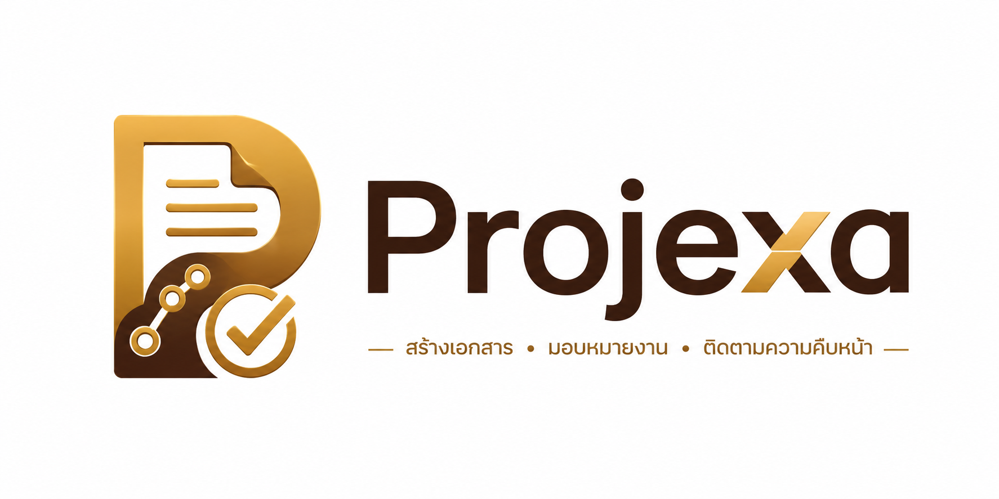

# Projexa Design System

- **วันที่สร้าง:** 2026-08-24
- **วันที่อัปเดตล่าสุด:** 2026-08-30 — รอบแก้ไขล่าสุด (เปลี่ยนชุดโทนสี/ฟอนต์/รูปทรงทั้งระบบให้ตรงกับไฟล์อ้างอิง `Projexa.html` ที่ user จัดทำไว้ภายนอกโปรเจกต์ — แทนที่ชุด "Gold & Umber" เดิมทั้งหมด ไม่ใช่การสร้างไฟล์ครั้งแรก)
- **สถานะ:** Draft — รอ Design Lead/PM ยืนยันก่อนนำไปใช้ตัดสินใจ implement จริง
- **ขอบเขต:** ใช้ควบคุมหน้าตาและพฤติกรรมของ **Web Application (Presentation Layer)** ของ Projexa เท่านั้น **ไม่ครอบคลุม** รูปแบบเอกสารส่งมอบ (.docx) ที่ต้องยึด Template `.dotx` ขององค์กรตามหลัก Template compliance ที่ระบุใน [Projexa-System-Design-R1.md](../../../Projexa-System-Design-R1.md) §7 — สองส่วนนี้เป็นระบบภาพที่แยกจากกันโดยตั้งใจ
- **อ้างอิง:** [Projexa-System-Design-R1.md](../../../Projexa-System-Design-R1.md), [[user-journey|user-journey]],
  `Projexa.html` (ไฟล์ตัวอย่างหน้าตาแอปที่ user จัดทำไว้ภายนอกโปรเจกต์ที่ root
  ของ repo — ต้นทางของโทนสี/ฟอนต์/รูปทรงชุดใหม่ในรอบนี้ทั้งหมด)

โทนที่ยึดตลอดทั้งระบบ (อัปเดตรอบนี้): **Warm Terracotta Workspace** — พลิกจากชุด
"Gold & Umber + Soft-lift Card" เดิมทั้งหมด มาใช้ชุดโทนสี/ฟอนต์/รูปทรงตามไฟล์
อ้างอิง `Projexa.html` ที่ user จัดทำไว้ภายนอกโปรเจกต์โดยตรง: พื้นหลังครีม-ทราย
อุ่น, การ์ด/พื้นผิวสีครีมอ่อนแบบ**แบน**ไม่มี shadow เด่นชัด (ต่างจากรอบก่อนที่
เน้น shadow), สี accent หลักเป็นส้ม-อิฐ (terracotta) แทนทอง-บรอนซ์เดิม, มีสี
accent รองเป็นเขียวเสจ (sage) กลับมาอีกครั้ง, ปุ่ม/แท็กเป็นทรง**pill เต็มขอบ
(border-radius 999px)**, และมี **sidebar สีเขียวเข้มเกือบดำ** เป็นพื้นหลัง
navigation หลัก (จุดที่ต่างจากทุกรอบก่อนหน้าที่ไม่เคยมีพื้นเข้มมาก่อน)

---

## 1. Brand Identity & CI

### 1.1 แนวคิดแบรนด์

Projexa เปลี่ยนวิธีทำงานของทีมจาก "เอกสารเป็นศูนย์กลาง" เป็น "ข้อมูลเป็นศูนย์กลาง" — บุคลิกภาพของแบรนด์จึงควรสื่อถึง **ความน่าเชื่อถือ ความสงบ และความเป็นระบบ** ไม่ใช่ความตื่นเต้นหรือฉูดฉาด เพราะผู้ใช้หลักคือทีม PM/BA/SA/QA ที่ต้องใช้งานทุกวันเป็นเวลานาน การออกแบบต้อง "อยู่เบื้องหลัง" และให้ข้อมูลเป็นพระเอก

**คำ 3 คำที่ใช้ตัดสินการออกแบบทุกจุด:**

| คำ | ความหมายเชิงปฏิบัติ |
|---|---|
| **Calm** | ไม่มีสีสันจัด ไม่มี animation ที่ดึงความสนใจโดยไม่จำเป็น พื้นหลังโทนอุ่นสบายตา ใช้งานได้ทั้งวันไม่ล้าตา |
| **Honest** | UI ไม่ตกแต่งให้ข้อมูลดูดีกว่าความเป็นจริง (เช่น ห้ามใช้สีเขียวสดกับความก้าวหน้าที่จริงๆ ล่าช้า) สอดคล้องกับหลัก Human-in-the-loop และ Everything is logged |
| **Structured** | ทุกหน้าจอมีลำดับชั้นของข้อมูลชัดเจน สื่อถึง Traceability ที่เป็นแกนของระบบ |

### 1.2 โทนสีและวัสดุอ้างอิง (Mood)

อ้างอิงจาก `Projexa.html` — ไฟล์ตัวอย่างหน้าตาแอปที่ user จัดทำไว้ภายนอก
โปรเจกต์โดยตรง (วางไว้ที่ root ของ repo) **แทนที่ mood board เดิมทั้งหมด**
ไฟล์นี้มีหน้าจอจริงของระบบ (Dashboard, ทะเบียนหน้าจอ, รายละเอียดหน้าจอ,
มอบหมายผู้รับผิดชอบ, บันทึกความก้าวหน้า ฯลฯ) ให้ดึง token สี/ฟอนต์/รูปทรงตรงๆ
ได้เลย ไม่ใช่แค่ mood/แรงบันดาลใจกว้างๆ เหมือนรอบก่อน

พื้นหลังโทนครีม-ทราย (ไม่ใช่ครีม-ขาวเหมือนรอบก่อน) พื้นผิวการ์ด/พาแนลเป็น
**ครีมอ่อนแบบแบน ไม่เน้น shadow** ต่างจากรอบก่อนที่เน้นการ์ดลอยด้วยเงานุ่ม
สี accent หลักเปลี่ยนจากทอง-บรอนซ์เป็น **ส้ม-อิฐ (terracotta)** และมีสี
accent รองเป็น**เขียวเสจ (sage)** กลับมาอีกครั้ง (คนละกลุ่มกับ "Sage &
Terracotta" ที่เคยถูกแทนที่ไปก่อนหน้านี้ — รอบนี้ใช้ hex ใหม่จาก
`Projexa.html` ไม่ใช่ค่าเดิม) ปุ่มและแท็ก/สถานะเปลี่ยนเป็นทรง **pill เต็มขอบ**
(border-radius `999px`) ทั้งหมด และมี **sidebar navigation พื้นเขียวเข้ม
เกือบดำ** ตัวอักษรครีมสว่าง เป็นจุดเปลี่ยนที่ไม่เคยมีในรอบก่อนหน้า (ทุกรอบก่อน
ใช้พื้นสว่างล้วนทั้งระบบ)

- สีอ้างอิง: ครีม-ทราย (พื้นหลังหน้า), ครีมอ่อน (การ์ด/พื้นผิว), ส้ม-อิฐ
  (accent หลัก), เขียวเสจ (accent รอง), เขียวเข้มเกือบดำ (พื้น sidebar) —
  ยังคง**ไม่ใช้สีดำสนิทหรือสีขาวสนิทกับข้อความ** เพื่อลดความแข็งกระด้าง
  (ตัวอักษรหลักเป็นสีน้ำตาลเข้มอมเทาเกือบดำ ไม่ใช่ `#000000`)
- การ์ด/Panel เปลี่ยนจาก **การ์ดขาวลอยด้วย shadow นุ่ม** ของรอบก่อน กลับมาเป็น
  **พื้นผิวแบน (flat)** อีกครั้ง — ใช้ความต่างของสีพื้น (การ์ดสีครีมอ่อนกว่า/
  เข้มกว่าพื้นหลังหน้าเล็กน้อย) เป็นตัวแบ่งพื้นที่แทน shadow เป็นหลัก เก็บ
  shadow ไว้ใช้เฉพาะ element ที่ลอยเหนือ layer อื่นจริงๆ (dropdown/modal/
  toast) เท่านั้น (ดู §2.4)
- ปุ่ม/แท็ก/สถานะ ใช้ทรง **pill เต็มขอบ** (`border-radius: 999px`) แทนมุมโค้ง
  `8px` ของรอบก่อน — เป็นจุดเปลี่ยนรูปทรงที่ชัดเจนที่สุดของรอบนี้
- ความคมชัดของ UI ยังคงมาจากการจัดวาง (layout) และ typography เป็นหลัก
  เช่นเดิม

> **หมายเหตุขอบเขตการอ้างอิง:** ดึงเฉพาะ token สี/ฟอนต์/รูปทรง/รูปแบบ
> component (ปุ่ม, แท็กสถานะ, ตาราง, sidebar, การ์ดสรุปตัวเลข) จาก
> `Projexa.html` เท่านั้น — เนื้อหา/ข้อมูลตัวอย่างในไฟล์นั้น (ชื่อโครงการ,
> ชื่อคน ฯลฯ) เป็นข้อมูลสมมติสำหรับ demo ไม่ใช่ต้นทางความจริงของระบบ

### 1.3 Logo / Wordmark

โปรเจกต์มีโลโก้จริงแล้ว:

ประกอบด้วย 2 ส่วน:

- **Mark (สัญลักษณ์):** ตัวอักษร "P" ที่หลอมจาก 3 องค์ประกอบ — (1) ไอคอนเอกสาร/กระดาษ สื่อถึงเอกสารส่งมอบ, (2) เส้นจุดเชื่อมกัน (connected nodes) สื่อถึง Full Traceability/workflow, (3) วงกลมเครื่องหมายถูก สื่อถึงการยืนยัน/Human-in-the-loop เรนเดอร์เป็นไล่เฉดทอง-บรอนซ์ 3D มันวาว
- **Wordmark:** "Projexa" ตัวอักษรสีน้ำตาลเข้ม (dark umber/chocolate) ตัว "x" เน้นด้วยสีทองเดียวกับ mark
- **Tagline:** "สร้างเอกสาร • มอบหมายงาน • ติดตามความคืบหน้า" สีทอง ตัวเล็ก มีเส้นขีดคั่นซ้าย-ขวา

**ข้อสังเกตสำคัญ — ความขัดแย้งกับกติกาแบน (flat) ของระบบ:** โลโก้นี้ใช้ gradient, bevel และแสงมันวาวแบบ 3D ซึ่ง**ขัดกับหลัก flat-surface เดิมของระบบ**และยังคงเป็นข้อยกเว้นแม้รอบนี้ระบบจะเปลี่ยนไปใช้ shadow มากขึ้นก็ตาม แนวทางที่แนะนำคือปฏิบัติกับโลโก้เป็น **"hero mark" ข้อยกเว้นเดียวของทั้งระบบ** ไม่ใช่ต้นแบบให้ effect อื่นๆ ใน UI ทำตาม:

| บริบทการใช้งาน | ใช้เวอร์ชันไหน |
|---|---|
| หน้า Login / Splash / เอกสารการตลาด / นามบัตร | เวอร์ชันทอง-บรอนซ์ 3D เต็มรูปแบบ (ตามภาพต้นฉบับ) |
| Sidebar header, favicon, ไอคอนขนาดเล็กในแอป (≤ 32px) | ต้องทำ **เวอร์ชัน flat/monochrome** แยกต่างหาก (ตัด gradient/bevel ออก เหลือ silhouette สีเดียว) เพราะไล่เฉดและรายละเอียดในสัญลักษณ์จะแตกเมื่อย่อเล็ก และขัดกับพื้นผิวของ UI ส่วนที่เหลือ |
| พื้นเข้ม (เช่น `sidebar-bg`) | ใช้เวอร์ชัน flat สีทองเดียวของโลโก้ — **ต้องคง literal hex ทองเดิมของโลโก้แยกต่างหาก** (ไม่ใช้ token `accent-500` ของระบบแทน) เพราะรอบนี้สี accent หลักของระบบเปลี่ยนเป็นส้ม-อิฐ (terracotta) ไม่ตรงกับสีทองจริงของโลโก้แล้ว (ต่างจากรอบก่อนหน้าที่ accent เคยตรงกับโลโก้พอดี) ไม่ใช้เวอร์ชัน 3D เต็มเพราะเงา/ไฮไลต์จะกลืนกับพื้นเข้ม |
| เนื้อหาในแอปทั่วไป (ปุ่ม, การ์ด, ตาราง) | **ไม่ใช้โลโก้** — คงหลัก "อยู่เบื้องหลัง ให้ข้อมูลเป็นพระเอก" ตาม §1.1 |

**กติกาการใช้งาน:**

- Clear space รอบโลโก้ ≥ ความสูงของตัว "P" ใน mark ทุกด้าน ห้ามวางองค์ประกอบอื่นล้ำเข้ามา
- ห้ามยืด/บีบสัดส่วน, เปลี่ยนสี mark เป็นสีอื่นนอกจากทอง-บรอนซ์ตามต้นฉบับหรือเวอร์ชัน flat ที่กำหนด, หรือเพิ่ม effect ซ้อนทับ (เช่น shadow เพิ่มเติม, outline)
- ขนาดต่ำสุดที่ยังอ่าน wordmark ได้ชัด: ความสูง mark ≥ 24px — ต่ำกว่านี้ให้ใช้ mark อย่างเดียวโดยไม่มี wordmark
- แท็กไลน์เป็น optional element ใช้เฉพาะจุดที่เป็นการแนะนำผลิตภัณฑ์ครั้งแรก (splash/landing) ไม่ใช้ซ้ำในทุกหน้าจอ

> **หมายเหตุ:** ไฟล์ต้นฉบับที่เก็บไว้ (`assets/Logo-Projexa.png`) เป็น PNG ไล่เฉดความละเอียดสูงเท่านั้น — ยังไม่มีไฟล์ vector (.svg/.ai) และยังไม่มีเวอร์ชัน flat/monochrome ตามตารางข้างต้น ทีมออกแบบควรจัดทำทั้งสองส่วนนี้เพิ่มก่อนนำไปใช้จริงในแอป (โดยเฉพาะ favicon/sidebar ที่ต้องใช้เวอร์ชัน flat) และเก็บไฟล์ vector ต้นทางไว้ใน `assets/` เดียวกันนี้ด้วยเพื่อให้แก้ไข/ย่อขนาดได้โดยไม่เสียคุณภาพ

### 1.4 Voice & Tone (ข้อความในระบบ)

- ใช้ภาษาไทยเป็นหลัก กระชับ ตรงไปตรงมา ไม่ใช้คำฟุ่มเฟือยหรือ emoji ในข้อความระบบ (system copy)
- Error message ต้องบอก "เกิดอะไรขึ้น" + "ควรทำอะไรต่อ" เสมอ ห้ามขึ้นแค่ "เกิดข้อผิดพลาด"
- ข้อความที่มาจาก AI (คำแนะนำ, ข้อมูลที่สกัดอัตโนมัติ) ต้องระบุที่มาเสมอ เช่น "สกัดจาก TOR โดยอัตโนมัติ — กรุณาตรวจสอบ" ห้ามใช้น้ำเสียงที่ทำให้ดูเหมือนเป็นข้อเท็จจริงที่ยืนยันแล้ว

---

## 2. Design Tokens

### 2.1 Color Tokens

> **ที่มา:** ดึงค่า hex ตรงจาก CSS custom properties จริงของ `Projexa.html`
> (ตรวจสอบด้วย computed style ในเบราว์เซอร์ ไม่ใช่การกะด้วยตา) แทนที่ชุด
> "Gold & Umber" เดิมทั้งหมด

หลักการ: ใช้ **neutral (ครีม/ทราย) เป็น 90% ของพื้นที่หน้าจอ** ส่วนสี accent
(`accent`, `accent-2`) ใช้เฉพาะจุดที่ต้องดึงความสนใจจริงๆ (primary action,
สถานะปัจจุบัน) ห้ามใช้ accent กับพื้นที่กว้าง ยกเว้น **sidebar navigation**
ที่ใช้พื้นเข้ม (`sidebar-bg`) เป็นข้อยกเว้นเดียวของระบบ (ดูท้ายหัวข้อนี้)

#### Neutral — "Sand & Cream"

| Token | Hex | การใช้งาน |
|---|---|---|
| `sand-100` | `#F9F4ED` | พื้นหลัง surface / card / table header / tag พื้นกลาง (`neutral-100`) |
| `bg-page` | `#F5EAD8` | พื้นหลังหน้าจอหลัก (page background) — ค่าตรงจาก `--color-bg` ของไฟล์อ้างอิง (เข้มกว่า `sand-100` เล็กน้อย เพื่อให้การ์ด/surface สว่างขึ้นมาต่างจากพื้นหลังได้โดยไม่ต้องพึ่ง shadow) |
| `sand-200` | `#EEE7DB` | พื้นผิวขั้นกลางระหว่าง `bg-page` กับ `sand-100` — ใช้กับ hover state ของแถวตาราง/รายการ |
| `surface-alt` | `#EBDDC5` | พื้นผิวรอง (input field, พื้นแถบเลือก) — ตรงจาก `--color-surface` |
| `sand-300` | `#DCD3C4` | เส้นแบ่งที่ยังจำเป็น (table, ขอบ input) |
| `sand-400` | `#C0B6A5` | border สถานะ disabled, skeleton loading |
| `sand-500` | `#A19786` | placeholder text, icon รอง, ตัวอักษร disabled |
| `sand-700` | `#645C50` | ข้อความรอง (secondary text), label |
| `ink-800` | `#474238` | ข้อความหลัก/tag ปกติ (`tag-neutral` text+border) |
| `ink-900` | `#2E2B25` | ข้อความหลักสุด (primary text, heading) — ใช้แทนสีดำทั้งระบบ |

#### Accent — "Terracotta & Sage"

อ้างอิงตรงจาก `Projexa.html` — ส้ม-อิฐ (terracotta) เป็น accent หลัก,
เขียวเสจ (sage) เป็น accent รอง (สำรองไว้ใช้ในอนาคต ไฟล์อ้างอิงยังไม่ได้โชว์
จุดใช้งานจริงชัดเจนในหน้าจอที่ตรวจสอบ)

| Token | Hex | การใช้งาน |
|---|---|---|
| `accent-100` | `#FFF2EB` | พื้นหลัง tint ของปุ่ม/แท็กที่ active หรือถูกเลือกแบบอ่อน |
| `accent-500` | `#D67F48` | สี accent มาตรฐานระดับกลาง |
| `accent-base` | `#C67139` | **Primary action** (ปุ่มหลัก, สถานะปัจจุบัน/current status pill, focus ring) — ค่าตรงจาก `--color-accent` ของไฟล์อ้างอิง ใช้บ่อยที่สุดในกลุ่ม accent |
| `accent-600` | `#B2622D` | สถานะ hover/active ของ `accent-base` |
| `accent-700` | `#8C491A` | ข้อความ/ขอบของ "next status" pill แบบ outline (ดู Status Pill ด้านล่าง) |
| `accent2-100` | `#F0FAE1` | พื้นหลัง tint ของ accent รอง (สำรอง) |
| `accent2-500` | `#8FA073` | Secondary accent (สำรอง — ยังไม่มีจุดใช้งานบังคับในสโคปปัจจุบัน) |
| `accent2-900` | `#272E1B` | **พื้นหลัง sidebar navigation** — เข้มเกือบดำ ใช้เป็นข้อยกเว้นพื้นเข้มจุดเดียวของระบบ |

#### Semantic (สถานะ)

ไฟล์อ้างอิงไม่ได้แยก semantic color (success/warning/danger/info) ไว้ชัดเจน
เป็นของตัวเอง — คงชุด semantic เดิมไว้ตามหลักการเดียวกัน แต่ปรับโทนให้กลืนกับ
พื้นครีม-ทรายชุดใหม่ (เช็ค contrast ratio ≥ 4.5:1 แล้ว):

| Token | Hex (text/icon) | Hex (bg tint) | ใช้กับ |
|---|---|---|---|
| `success` | `#5B7A45` | `#F0FAE1` | บันทึกสำเร็จ, Test Result: Pass, สถานะ Confirmed — ใช้กลุ่มสีเดียวกับ `accent2` (sage) |
| `warning` | `#B3812E` | `#FFF2EB` | ใกล้ครบกำหนด, ข้อมูลรอตรวจสอบ, ผลสกัด AI ที่ยังไม่ยืนยัน |
| `danger` | `#B23A2D` | `#FBE4DE` | เลยกำหนด, Test Result: Fail, ลบ/ยกเลิก |
| `info` | `#6E63C8` | `#EBE8FA` | ข้อความแนะนำ, สถานะ In Review — ไม่มีในไฟล์อ้างอิง คงค่าเดิมไว้เพราะยังกลืนกับโทนใหม่ได้ |

**Status pill มาตรฐาน** (รูปแบบใหม่ทั้งหมด — สังเกตจาก `Projexa.html` จริง
ไม่ใช่การไล่สีตามลำดับสถานะแบบรอบก่อน):

| สถานะในวงจร | รูปแบบ pill |
|---|---|
| สถานะปัจจุบัน (current) | พื้น `accent-base` เต็ม + ตัวอักษร `sand-100` (filled) |
| สถานะถัดไปที่ยังไม่ถึง (next) | พื้นโปร่ง + ขอบ/ตัวอักษร `accent-700` (outline) — ใช้บอกใบ้ว่า "ไปต่อได้" |
| สถานะอื่นที่ผ่านมาแล้ว/ยังไม่ถึงอีกไกล | พื้น `sand-100` + ตัวอักษร/ขอบ `ink-800` (neutral) |
| Archived | `sand-400` ตัวอักษร + ขีดทับ (strikethrough) — ไม่มีในไฟล์อ้างอิง คงกติกาเดิมไว้ |

ทุก pill เป็นทรง **pill เต็มขอบ** (`border-radius: 999px`) ตาม §2.4 — เปลี่ยน
จากมุมโค้ง `8px` ของรอบก่อน

**กติกาเข้าถึงได้ (accessibility):** คู่สี text/background ทุกคู่ในตารางข้างต้นต้องผ่าน contrast ratio ≥ 4.5:1 (WCAG AA) — ห้ามใช้สีเป็นตัวบอกสถานะเพียงอย่างเดียว ต้องมี label ข้อความ/ไอคอนควบคู่เสมอ (สำคัญมากสำหรับ status pill เพราะผู้ใช้บางคนอาจแยกสีไม่ชัด)

### 2.2 Typography

> เปลี่ยนชุดฟอนต์ทั้งหมดตาม `Projexa.html` (ตรวจสอบ `font-family` จริงที่
> render จากเบราว์เซอร์ ไม่ใช่แค่ตัวแปร CSS ที่ประกาศไว้ — พบว่าตัวแปร
> `--font-heading: Caprasimo` ที่ประกาศไว้ในไฟล์จริงๆ **ไม่ถูกใช้กับข้อความ
> ไทยเลย** เพราะ Caprasimo ไม่มีตัวอักษรไทย หัวข้อ/ปุ่ม/แบรนด์ที่เป็นภาษาไทย
> ทั้งหมด render ด้วย **Mitr** แทน — เอกสารนี้ยึดตามฟอนต์ที่ render จริง)

| ระดับ | Font | ใช้กับข้อความ |
|---|---|---|
| หัวข้อ/แบรนด์/ปุ่ม (ไทย) | **Mitr** (fallback: system-ui, sans-serif) | ชื่อแบรนด์ "Projexa", page title, ปุ่มทุกชนิด, tab, h1–h3 |
| เนื้อหาไทยทั่วไป | **Noto Sans Thai** (fallback: Figtree, system-ui) | ข้อความเนื้อหา (body), label, ตาราง, ฟอร์ม |
| ภาษาอังกฤษ/ตัวเลข | **Figtree** (fallback: system-ui) | Label ภาษาอังกฤษ, ตัวเลข, วันที่ |
| Code/รหัสอ้างอิง | **IBM Plex Mono** (คงไว้ตามเดิม — ไม่มีในไฟล์อ้างอิง) | รหัสหน้าจอ (SCR-001), TOR Clause ID, รหัส test case |
| Decorative/hero เฉพาะจุด (ละติน) | **Caprasimo** | ใช้เฉพาะจุดตกแต่งภาษาอังกฤษล้วน (ถ้ามี) เช่นเดียวกับที่โลโก้ 3D เป็นข้อยกเว้นของระบบใน §1.3 — **ห้ามใช้กับข้อความไทย** เพราะไม่มีตัวอักษรไทยให้ fallback ที่หน้าตาเข้ากัน |

หลักความเรียบง่าย: ใช้ font-weight เพียง **3 ระดับ** ตลอดระบบ — `regular (400)`, `medium (500)`, `semibold (600)` ห้ามใช้ `bold (700)` หรือ italic เพื่อรักษาความรู้สึกสงบ (ไฟล์อ้างอิงส่วนใหญ่ใช้ `regular (400)` แม้กับหัวข้อ — ถือเป็นเกณฑ์ขั้นต่ำที่ยอมรับได้ ไม่บังคับต้องหนักกว่านี้)

| Scale | Size / Line-height | Weight | ใช้กับ |
|---|---|---|---|
| `display` | 28px / 36px | semibold | ชื่อหน้า (page title) ระดับบนสุด |
| `h1` | 24px / 32px | semibold | หัวข้อ section หลัก |
| `h2` | 20px / 28px | semibold | หัวข้อ card / panel |
| `h3` | 16px / 24px | medium | หัวข้อย่อย, table header |
| `body` | 14px / 22px | regular | ข้อความเนื้อหาหลัก (base font size) |
| `body-sm` | 13px / 20px | regular | ข้อความรองในตาราง/ฟอร์ม |
| `caption` | 12px / 16px | regular | timestamp, helper text, metadata (สีเทา `sand-500`) |

### 2.3 Spacing (4px grid)

ยึดหน่วยฐาน 4px และเพิ่มพื้นที่ว่างมากกว่าระบบทั่วไป:

`4 · 8 · 12 · 16 · 24 · 32 · 48 · 64` (px)

- ระยะห่างภายในองค์ประกอบเล็ก (padding ปุ่ม, input): `8–12px`
- ระยะห่างระหว่างองค์ประกอบในกลุ่มเดียวกัน (field ในฟอร์มเดียวกัน): `16px`
- ระยะห่างระหว่างกลุ่ม/section: `32px`
- ระยะขอบ page container: `48–64px` (desktop), `16px` (mobile)

### 2.4 Radius, Border, Shadow

> **หมายเหตุ:** รอบนี้พลิกกลับอีกครั้ง — จาก "การ์ดลอยด้วย shadow" ของรอบก่อน
> กลับมาเป็น **"การ์ดพื้นแบน ใช้สีต่างระดับแทน shadow"** ตาม `Projexa.html`
> (ตรวจสอบด้วย computed style จริงแล้วว่าการ์ดส่วนใหญ่ไม่มี `box-shadow`
> เลย) และเปลี่ยน border-radius เป็นทรง **pill เต็มขอบ** สำหรับปุ่ม/แท็ก —
> ไม่ใช่แค่ "โค้งมากขึ้น" เหมือนรอบก่อนแล้ว

- **Border-radius:** `8px` (`radius-sm` — input, field เล็ก) · `16px`
  (`radius-md` — card, table) · `28px` (`radius-lg` — modal, dialog ใหญ่,
  เพิ่มจาก `20px` เดิม) · `999px` (`radius-pill` — **ปุ่มและแท็ก/status pill
  ทุกชนิด** — ค่าใหม่ที่ไม่มีในรอบก่อน)
- **Card / Panel:** พลิกกลับจาก shadow-based เป็น **flat-surface อีกครั้ง** —
  ใช้สี `sand-100` (สว่างกว่า `bg-page` เล็กน้อย) เป็นพื้นการ์ด **ไม่มี
  border และไม่มี shadow เป็นค่าเริ่มต้น** ความต่างของสีพื้นเพียงพอต่อการแบ่ง
  พื้นที่แล้วในโทนนี้
- **Border:** ยังใช้ได้กับ table (เส้นแบ่งแถว, สี `sand-300`) และ input/form
  (ขอบฟอร์ม, สี `sand-300`) เหมือนเดิม
- **Shadow:** ใช้เฉพาะ element ที่ลอยเหนือ layer อื่นจริงๆ เท่านั้น (การ์ด/
  panel ปกติไม่ใช้เลยตามข้อข้างบน) มี 3 ระดับ (เพิ่มจาก 2 ระดับเดิม):
  - **sm** — จุดสัมผัสเล็กๆ ที่ต้องการแยกชั้นบางๆ (เช่น item ที่ active ใน
    sidebar): `0 1px 2px rgba(46, 43, 37, 0.14)`
  - **md** — dropdown, popover: `0 3px 10px rgba(46, 43, 37, 0.16)`
  - **lg** — modal, dialog, toast (ลอยสูงสุด): `0 12px 32px rgba(46, 43, 37, 0.22)`

### 2.5 Motion

- Transition มาตรฐาน: `150–200ms ease-out` สำหรับ hover/focus/expand
- ห้ามใช้ animation แบบ bounce, spring, หรือ effect ที่ดึงความสนใจโดยไม่มีเหตุผลเชิงหน้าที่
- ต้องรองรับ `prefers-reduced-motion` — ปิด transition ที่ไม่ใช่ functional (เช่น fade-in ของ toast) ให้ผู้ใช้ที่ตั้งค่านี้ไว้

---

## 3. UI Components & Patterns

หลักทั่วไป: component ทุกตัวสร้างจาก token ใน §2 เท่านั้น ห้าม hardcode สี/ระยะห่างใหม่ในระดับ component

### 3.1 Core Components

| Component | กติกาออกแบบ |
|---|---|
| **Button** | Primary = พื้น `accent-base` ตัวอักษร `sand-100` radius `999px` (pill) ฟอนต์ `Mitr`; Secondary = พื้นโปร่ง border `sand-300` ตัวอักษร `ink-900` radius `999px`; Destructive = พื้นโปร่ง ตัวอักษร `danger` border `danger` เฉพาะ hover ค่อยเติมพื้น มีปุ่มระดับเดียวต่อหน้าจอที่เป็น Primary เท่านั้น (ห้ามมี Primary หลายปุ่มแข่งกัน) |
| **Input / Textarea / Select** | พื้น `surface-alt` border `1px sand-300` radius `8px` (**ไม่ใช่ pill** — เฉพาะปุ่ม/แท็กเท่านั้นที่เป็น pill) focus = border `accent-base` + ring บาง 2px สี `accent-100` label อยู่เหนือ field เสมอ (ไม่ใช้ placeholder แทน label) |
| **Card / Panel** | พื้น `sand-100` **ไม่มี border ไม่มี shadow เป็นค่าเริ่มต้น** (flat-surface ตาม §2.4) radius `16px` ใช้แบ่งกลุ่มข้อมูลที่เกี่ยวข้องกัน ไม่ใช่ตกแต่ง |
| **Table** | Header ใช้ `h3` scale บนพื้น `sand-100`, แถวสลับสี `bg-page`/`sand-100` แบบจางมาก (ไม่ใช่ zebra จัด), แถวที่ hover ใช้ `sand-200`, เส้นแบ่งแถวยังใช้ border `sand-300` ตามปกติ |
| **Tag / Badge** | ใช้กับ MoSCoW label, module code — พื้น bg-tint + ตัวอักษรสีเข้มของ token เดียวกัน radius `999px` (pill) padding แน่น |
| **Status Pill** | ดู §2.1 ตาราง "Status pill มาตรฐาน" (filled = current / outline = next / neutral = อื่นๆ) radius `999px` เสมอ ต้องมีจุด (dot) นำหน้าข้อความเมื่อใช้แทนความหมายสีเพิ่มเติม เพื่อแยกจาก Tag ทั่วไป |
| **Navigation (Sidebar)** | พื้น `accent2-900` (เขียวเข้มเกือบดำ — ข้อยกเว้นพื้นเข้มจุดเดียวของระบบ) ตัวอักษร `sand-100`/`bg-page` (ครีมสว่าง), แบรนด์/label ใช้ฟอนต์ `Mitr`, item ที่ active = พื้น tint อ่อนของ `accent2-900` (เช่น `accent2-800` หรือ overlay สีขาวโปร่งบาง) + ตัวอักษรสว่างขึ้น/underline บาง ไม่ใช้ไอคอนสีสันจัด ไอคอนเป็น outline บาง สีเดียวกับข้อความ |
| **Tabs** | เส้นใต้ (underline) บาง 2px สี `accent-base` สำหรับ tab ที่เลือก ไม่ใช้พื้นหลังเต็ม tab |
| **Modal / Dialog** | radius `28px` (`radius-lg`), shadow **lg** ตาม §2.4 (ลอยสูงสุด), มี overlay สี `ink-900` ความโปร่งใส 40% เท่านั้น (ไม่ใช้ blur) |
| **Toast / Notification** | มุมขวาบน, shadow **lg** ตาม §2.4, ไอคอนสถานะ + ข้อความสั้น, auto-dismiss 4 วินาที ยกเว้น error ต้องกดปิดเอง |
| **Breadcrumb** | ใช้ตัวอักษร `body-sm` สี `sand-700`, ตัวคั่นเป็น `/` บาง สี `sand-400` |
| **Empty State** | ข้อความ + คำแนะนำขั้นถัดไปเสมอ (ห้ามแสดงแค่ "ไม่มีข้อมูล") ไม่ใช้ illustration สีสันจัด ถ้าจะใช้ภาพให้เป็น line-art เดียวสี `sand-400` |
| **Pagination** | ตัวเลขเรียบ ไม่มีพื้นหลังเต็มที่หน้าปัจจุบัน ใช้แค่ตัวอักษร `accent-600` + ขีดล่างบาง |
| **Avatar (ผู้รับผิดชอบ)** | วงกลม พื้น tint อ่อนของ `accent`/`accent2` สลับกันตามคน ตัวอักษรย่อชื่อ 1–2 ตัว สี `ink-900` ใช้คู่กับชื่อเต็มในตาราง/การ์ดเสมอ (ไม่ใช้ avatar เดี่ยวๆ โดยไม่มี label) — pattern นี้เห็นได้จากไฟล์อ้างอิงในตาราง SCR-009/SCR-013 |

### 3.2 Project-specific Patterns

Component เฉพาะของ Projexa ที่ผูกกับหลักการออกแบบระบบใน [Projexa-System-Design-R1.md](../../../Projexa-System-Design-R1.md):

| Pattern | จุดประสงค์ | กติกาออกแบบ |
|---|---|---|
| **AI Suggestion Block** | แยกข้อมูลที่ AI สกัด/เสนอ ออกจากข้อมูลที่คนยืนยันแล้ว (Human-in-the-loop) | ใช้ border แบบ dashed สี `warning`, มีแท็กเล็ก "AI เสนอ" มุมซ้ายบน และปุ่ม "ยืนยัน" / "แก้ไข" ติดกับ block เสมอ — เมื่อคนกดยืนยันแล้ว border เปลี่ยนเป็น solid `sand-300` ปกติทันที |
| **Traceability Trail** | แสดงสายโยง `TorClause → Requirement → Screen → TestCase → TestResult` | แสดงเป็นแถวของ pill เชื่อมด้วยเส้นบาง สี `sand-400` แต่ละ pill กดเพื่อไปยังต้นทาง/ปลายทางได้ วางไว้ใต้หัวข้อหลักของหน้าจอที่มีความสัมพันธ์นี้ |
| **Audit / History Chip** | สื่อว่า "ใครแก้ ทำไม เมื่อไหร่" (Everything is logged) | ไอคอนนาฬิกาเล็กข้าง field ที่แก้ไขได้ กด/hover เพื่อเปิด popover ประวัติการเปลี่ยนแปลงแบบเรียงเวลา ไม่ต้องเปิดหน้าใหม่ |
| **Workflow Stepper** | แสดงขั้นตอน TOR → Requirement → Design → Test → Document ในภาพรวม | เส้นแนวนอน จุดที่ผ่านแล้ว = `accent2-500`, จุดปัจจุบัน = `accent-base`, จุดที่ยังไม่ถึง = `sand-400` ห้ามใช้สีเดาสถานะที่ยังไม่เกิดขึ้นจริง (แพทเทิร์นเดียวกับ Status Pill ใน §2.1: current = filled accent, ผ่านแล้ว = โทนสงบกว่า, ยังไม่ถึง = neutral) |
| **TOR Upload Dropzone** | จุดเริ่มต้นของ workflow ทั้งระบบ | กรอบ dashed สี `sand-400` พื้น `sand-100` ไอคอน upload เรียบสีเดียว ไม่ใช้สีสันดึงดูดเกินจำเป็น เพราะเป็น action ที่ทำครั้งเดียวต่อโครงการ ไม่ต้องแข่งความสนใจกับ action อื่น |
| **Document Generation Trigger** | ปุ่มสั่งสร้างเอกสาร .docx จาก template | ต้องมี label ระบุ template ที่จะใช้ชัดเจน (เช่น "สร้าง REQ ตาม Template องค์กร") เพื่อย้ำว่าผลลัพธ์คุมรูปแบบด้วย `.dotx` ไม่ใช่ AI จัดหน้าเอง |

---

## 4. UX Guidelines & Rules

### 4.1 หลักที่ผูกกับสถาปัตยกรรมระบบ (บังคับ)

หลักการเหล่านี้มาจาก [Projexa-System-Design-R1.md](../../../Projexa-System-Design-R1.md) และ CLAUDE.md ของโปรเจกต์ — UI ต้องสื่อสารหลักการเหล่านี้ให้ผู้ใช้ "เห็น" ได้ ไม่ใช่แค่ทำงานถูกต้องเบื้องหลัง:

1. **Single Source of Truth** — ห้ามมีฟอร์มกรอกข้อมูลซ้ำที่มีอยู่แล้วในระบบ ทุก field ที่ดึงจากข้อมูลกลางต้องมีสถานะ read-only ชัดเจน (พื้น `sand-100` ตัวอักษร `sand-700`) และมีลิงก์ไปยังต้นทางเสมอ
2. **Full Traceability** — ทุกหน้าจอที่แสดง Requirement/Screen/TestCase ต้องมี Traceability Trail (§3.2) ห้ามซ่อนไว้ในเมนูลึก
3. **Human-in-the-loop** — ข้อมูลที่มาจาก AI ต้องผ่าน AI Suggestion Block (§3.2) เสมอ ห้ามให้ข้อมูล AI ไหลเข้าระบบเป็น "ข้อเท็จจริง" โดยไม่มีจุดยืนยันของคน แม้ในกรณี auto-fill ที่ดูน่าเชื่อถือมากก็ตาม
4. **Everything is logged** — field สำคัญ (สถานะ, ผู้รับผิดชอบ, วันที่) ต้องมี Audit/History Chip (§3.2) กดดูได้ทุกจุด
5. **Template compliance** — UI ของเว็บแอปออกแบบได้อย่างอิสระตาม design system นี้ แต่ **หน้าตาของเอกสารที่ export ออกมาต้องไม่ถูก UI นี้ครอบงำ** — ปุ่ม/หน้าจอสร้างเอกสารต้องสื่อชัดว่าผลลัพธ์จะยึด Template `.dotx` ไม่ใช่สไตล์ของเว็บแอป

### 4.2 Layout & Grid

- Desktop-first (ตาม MVP ที่เน้นทีมงานใช้ในสำนักงาน) แต่ต้อง responsive ได้ถึง tablet เป็นอย่างน้อย
- Grid หลัก: sidebar คงที่ 240px + content area ไหลตาม container โดยมี max-width เนื้อหา `1200px` เพื่อไม่ให้ตารางข้อมูลยาวเกินอ่านง่าย
- ทุกหน้าจอ list/table ต้องมีพื้นที่สำหรับ filter/search อยู่บนสุดแบบตำแหน่งเดียวกันทุกหน้า (ความสม่ำเสมอ = ความสงบ)

### 4.3 Accessibility

- Contrast ratio ข้อความ/พื้นหลัง ≥ 4.5:1 ทุกจุด (ดู §2.1)
- ทุก interactive element ต้องมี focus state ที่มองเห็นชัด (ring สี `accent-base`) รองรับการใช้ keyboard navigation ล้วน
- ห้ามสื่อความหมายด้วยสีอย่างเดียว (สถานะ, error, required field ต้องมี icon/label ควบคู่)
- ขนาดตัวอักษร base ต้อง ≥ 14px และรองรับการ zoom ของ browser โดยไม่พังเลย์เอาต์

### 4.4 States (Loading / Empty / Error)

- **Loading:** ใช้ skeleton (พื้น `sand-400` เรียบ, ไม่ animate แบบ shimmer สีสันจัด) ห้ามใช้ spinner หมุนตลอดหน้าจอเว้นแต่เป็น full-page transition จริงๆ
- **Empty:** ต้องมีคำแนะนำ action ถัดไปเสมอ (ดู §3.1 Empty State) เช่นหน้า "ทะเบียนโครงการ" ที่ยังไม่มีโครงการ ต้องมีปุ่ม "เริ่มต้นโดยนำเข้า TOR" ไม่ใช่แค่ "ไม่มีข้อมูล"
- **Error:** ตามหลัก Voice & Tone (§1.4) ต้องบอกสาเหตุ + ทางแก้ และใช้สี `danger` เฉพาะกับตัว error message/icon ไม่ทาสีพื้นหลังทั้ง block ด้วยสีแดงเข้ม

### 4.5 Content & Microcopy

- ใช้คำเดียวกันตลอดระบบสำหรับ concept เดียวกัน (เช่น เรียก "ยืนยัน" ทุกจุด ห้ามสลับกับ "อนุมัติ"/"รับรอง" ในบริบทเดียวกัน)
- วันที่แสดงผลรูปแบบ `DD/MM/YYYY` (พ.ศ. หรือ ค.ศ. ต้องเลือกใช้แบบเดียวตลอดระบบ — แนะนำ ค.ศ. เพื่อให้ตรงกับ field วันที่ในฐานข้อมูล ลด mapping error)
- ตัวเลข MoSCoW/สถานะที่เป็นการประเมินของ AI ต้องมีคำว่า "(แนะนำ)" ต่อท้ายใน UI เช่นเดียวกับ convention ที่ใช้ใน [[user-journey|user-journey]] และ `feature-list.md`

---

## หมายเหตุ

เอกสารนี้เป็น **Draft ฉบับแรก** สร้างขึ้นตามคำขอให้จัดทำ Design System โทน Earth tone + Minimalist + Muji-inspired ยังไม่ผ่านการยืนยันจาก Design Lead/PM/SA — เมื่อลงมือพัฒนา UI จริง ควรนำ token ใน §2 ไปแปลงเป็นไฟล์ config จริง (เช่น Tailwind theme / CSS variables) ในโค้ดเบส และปรับปรุงเอกสารนี้ให้ตรงกับของจริงที่ implement เมื่อ repo เริ่มมีซอร์สโค้ด

**อัปเดต 2026-08-24 (รอบแก้ไข):** ปรับโทนสี/สไตล์ตาม mood board ที่ผู้เกี่ยวข้องส่งภาพตัวอย่างมาให้ (ภาพ dashboard ของระบบอื่นที่ไม่เกี่ยวข้องกับ Projexa ใช้เป็นแรงบันดาลใจด้านสีและสไตล์การ์ด/shadow เท่านั้น ไม่ใช่การลอกฟีเจอร์หรือโครงสร้างหน้าจอ) เปลี่ยนจากแนว Muji flat/border-only (กลุ่มโทนสี "Stone & Paper" / "Clay & Moss") เป็นแนวการ์ดขาวลอย shadow มุมโค้งมากขึ้น (กลุ่มโทนสี "Cream & White" / "Sage & Terracotta") พลิกหลักการ border-based เดิมของการ์ด/panel มาเป็น shadow-based ยังคงสถานะ Draft รอ Design Lead/PM ยืนยันเช่นเดิม

**อัปเดต 2026-08-24 (รอบแก้ไขล่าสุด):** เปลี่ยนกลุ่มสี Accent จาก "Sage & Terracotta" (เขียวเสจ/ส้มอิฐ ตาม mood board รอบก่อน) เป็น **"Gold & Umber"** (ทอง-บรอนซ์/น้ำตาลเข้ม) ให้ตรงกับสีจริงของโลโก้ Projexa (`assets/Logo-Projexa.png`) ตามคำขอของ user ที่มองว่าโทนเดิม "จืดไป" และอยากให้ระบบกับแบรนด์ไปในทิศทางเดียวกัน — เปลี่ยนเฉพาะกลุ่ม Accent เท่านั้น (Neutral "Cream & White" และ Radius/Border/Shadow §2.4 ไม่เปลี่ยน) Semantic colors (success/warning/danger/info) ไม่เปลี่ยนเช่นกันเพราะเป็นสีความหมายเชิงฟังก์ชัน ไม่เกี่ยวกับแบรนด์

**อัปเดต 2026-08-30 (รอบแก้ไขล่าสุด — เปลี่ยนทั้งระบบ):** user จัดทำไฟล์
ตัวอย่างหน้าตาแอป `Projexa.html` ไว้ภายนอกโปรเจกต์ (root ของ repo) แล้วขอให้
ใช้เป็นต้นทางหน้าตาของ prototype `v2` (SCR-009/010/013/016 ในสโคปงานส่ง
หลักสูตร NoSQL) — ตรวจสอบด้วย computed style จริงจากเบราว์เซอร์ (ไม่ใช่กะด้วย
ตา) แล้วพบว่าโทนสี/ฟอนต์/รูปทรงต่างจาก "Gold & Umber" เดิมมาก user ยืนยันให้
**อัปเดต DESIGN.md ทั้งฉบับ**ให้ตรงกับไฟล์อ้างอิงนี้แทนการทำ v2 แยกสีเอง
(เพื่อให้ v2 เป็นก้าวแรกของหน้าตาระบบชุดใหม่ ไม่ใช่ข้อยกเว้นเดี่ยวๆ) การเปลี่ยน
รอบนี้ครอบคลุม: Neutral (Cream&White → Sand&Cream), Accent (Gold&Umber →
Terracotta&Sage), เพิ่ม token พื้นเข้มสำหรับ sidebar (ไม่เคยมีมาก่อน), ฟอนต์
ไทยหลัก (IBM Plex Sans Thai → Mitr สำหรับหัวข้อ/ปุ่ม + Noto Sans Thai สำหรับ
เนื้อหา), border-radius เพิ่มทรง pill เต็มขอบ (`999px`) สำหรับปุ่ม/แท็ก/status
pill, และพลิก Card/Panel จาก shadow-based กลับเป็น flat-surface อีกครั้ง —
**`v1` (SCR-003) ไม่ถูกแก้ไขเพราะเป็น self-contained snapshot ตาม CLAUDE.md**
(`v1/style.css` ยังคงใช้ token "Gold & Umber" เดิมที่ก๊อปปี้ไว้ตอนสร้าง จึงจะ
ต่างหน้าตาจาก `v2` ไปจนกว่าจะมีคนสั่งรีเฟรช `v1` แยกต่างหาก) สถานะเอกสารยังคง
`Draft` เหมือนเดิม รอ Design Lead/PM ยืนยันอย่างเป็นทางการ
