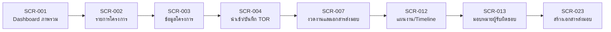
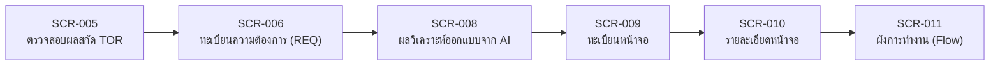
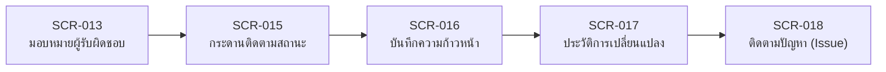
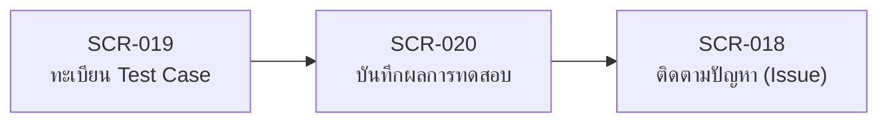
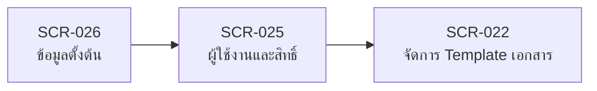

# User Journey — Projexa

- **วันที่สร้าง/อัปเดตล่าสุด:** 2026-08-24
- **สถานะ:** Draft — สังเคราะห์อัตโนมัติ ยังไม่ผ่านการยืนยันจาก SA
- **สร้างโดย:** skill `gen-feature-journey` (sub-agent `requirements-synthesizer`)
- **อ้างอิงต้นทาง:** [Projexa-System-Design-R1.md](../../../Projexa-System-Design-R1.md) §9, [[../../01-requirements/feature-list|feature-list]]

> แต่ละ diagram ในเอกสารนี้เป็น mermaid `flowchart` (ไม่ใช่ `journey`) เพื่อเลี่ยงการใส่คะแนนความพึงพอใจที่ไม่มีข้อมูลจริงรองรับ ดู [[../../01-requirements/01-spec/20260824-011-scr-011-ผังการทำงาน-flow|SCR-011]] สำหรับ flow ระดับหน้าจอแบบละเอียดกว่านี้

> อิงจาก [[../../Projexa-System-Design-R1|Projexa-System-Design-R1.md]] §9 (Workflow end-to-end) และ §5 (ตารางหน้าจอ 26 หน้าจอ) ทุก node อ้างอิงรหัส SCR จริงเท่านั้น ไม่มี node ที่ไม่มีหน้าจอรองรับ
> ใช้ mermaid `flowchart` แทน `journey` ทั้งหมด เพราะ `journey` diagram บังคับใส่คะแนนความพึงพอใจ 1–5 ที่ไม่มีข้อมูลจริงรองรับ

## (ก) ภาพรวม End-to-End

```mermaid
flowchart TD
    subgraph PM1["PM"]
        A1["SCR-003<br/>ข้อมูลโครงการ"]
        A2["SCR-004<br/>นำเข้า/บันทึก TOR"]
        A1 --> A2
    end

    subgraph AI1["AI"]
        B1["SCR-004<br/>แสดงสถานะการสกัด TOR"]
    end

    subgraph BAPM["BA/PM"]
        C1["SCR-005<br/>ตรวจสอบผลสกัด TOR"]
        C2{"Gate 1<br/>ยืนยันผลสกัดแล้วหรือไม่?"}
        C3["SCR-006<br/>ทะเบียนความต้องการ (REQ)"]
        C4["SCR-007<br/>งวดงานและเอกสารส่งมอบ"]
        C1 --> C2
        C2 -->|ยืนยันผ่าน| C3
        C3 --> C4
    end

    subgraph AI2["AI"]
        D1["SCR-008<br/>ผลวิเคราะห์ออกแบบจาก AI"]
    end

    subgraph SA1["SA"]
        E1["SCR-008<br/>ตรวจสอบ/ปรับแก้ผลวิเคราะห์"]
        E2{"Gate 2<br/>ยืนยันหน้าจอ/Flow แล้วหรือไม่?"}
        E3["SCR-009<br/>ทะเบียนหน้าจอ"]
        E4["SCR-010<br/>รายละเอียดหน้าจอ"]
        E1 --> E2
        E2 -->|ยืนยันผ่าน| E3
        E3 --> E4
    end

    subgraph PM2["PM"]
        F1["SCR-013<br/>มอบหมายผู้รับผิดชอบ"]
    end

    subgraph TEAM["ทีม"]
        G1["SCR-016<br/>บันทึกความก้าวหน้า"]
        G2["SCR-017<br/>ประวัติการเปลี่ยนแปลง"]
        G1 --> G2
    end

    subgraph TESTER["Tester"]
        H1["SCR-019<br/>ทะเบียน Test Case"]
        H2["SCR-020<br/>บันทึกผลการทดสอบ"]
        H3["SCR-018<br/>ติดตามปัญหา (Issue)"]
        H1 --> H2 --> H3
    end

    subgraph PM3["PM"]
        I1["SCR-023<br/>สร้างเอกสารส่งมอบ"]
        I2["SCR-021 / SCR-024<br/>เก็บเวอร์ชันไว้ในคลังเอกสาร"]
        I1 --> I2
    end

    A2 --> B1
    B1 --> C1
    C2 -->|ไม่ผ่าน กลับไปแก้ไข/สกัดใหม่| B1
    C4 --> D1
    D1 --> E1
    E2 -->|ไม่ผ่าน กลับไปปรับแก้ผลวิเคราะห์| D1
    E4 --> F1
    F1 --> G1
    G2 --> H1
    H3 --> I1
```

**คำอธิบาย:** Gate 1 (บนหน้าจอ SCR-005) คือจุดที่ BA/PM ต้องยืนยันผลสกัด TOR ของ AI ก่อนที่ข้อมูลจะกลายเป็น Requirement (SCR-006) และงวดงาน (SCR-007) อย่างเป็นทางการ — ถ้าไม่ผ่าน ระบบจะวนกลับไปให้แก้ไข/สั่งสกัดใหม่แทนที่จะปล่อยให้ข้อมูลผิดไหลต่อ Gate 2 (บนหน้าจอ SCR-008) คือจุดที่ SA ต้องยืนยันผลวิเคราะห์ Flow/หน้าจอของ AI ก่อนที่รายการจะกลายเป็นทะเบียนหน้าจอ (SCR-009) และรายละเอียดหน้าจอ (SCR-010) อย่างเป็นทางการ ทั้งสอง Gate นี้คือกลไก Human-in-the-loop ตามหลักการที่ระบุใน §1 และ §7.2 ของเอกสารออกแบบระบบ — AI เสนอเท่านั้น คนต้องยืนยันก่อนข้อมูลจะถูกบันทึกเป็นทางการและไหลต่อไปยังขั้นตอนถัดไป การมี Gate ทั้งสองจุดนี้ยังเป็นสิ่งที่ทำให้สาย traceability (TorClause→Requirement→Screen→TestCase→TestResult ตาม §4.2) น่าเชื่อถือ เพราะทุกจุดเชื่อมถูกคนยืนยันแล้วจริง ไม่ใช่ผลดิบจาก AI

## (ข) Diagram ย่อยรายบุคคล (Persona)

### 1. PM (Project Manager)

1. **SCR-001 Dashboard ภาพรวม** — PM เข้าระบบมาดูภาพรวมความก้าวหน้าทุกโครงการก่อน
2. **SCR-002 รายการโครงการ** — เลือกหรือค้นหาโครงการที่ต้องการทำงานต่อ
3. **SCR-003 ข้อมูลโครงการ** — สร้างโครงการใหม่หรือแก้ไขข้อมูลพื้นฐาน (ลูกค้า ระยะเวลา งบประมาณ ทีมงาน)
4. **SCR-004 นำเข้า/บันทึก TOR** — อัปโหลดไฟล์ TOR เพื่อให้ AI เริ่มสกัดข้อมูล
5. **SCR-007 งวดงานและเอกสารส่งมอบ** — กำหนดงวดงานและเอกสารที่ต้องส่งมอบแต่ละงวด
6. **SCR-012 แผนงาน/Timeline** — ดูภาพรวมแผนงานแบบ Gantt ตามงวดงานและหน้าจอ
7. **SCR-013 มอบหมายผู้รับผิดชอบ** — มอบหมาย SA/BA/Dev/Tester ให้แต่ละหน้าจอ
8. **SCR-023 สร้างเอกสารส่งมอบ** — เมื่อถึงงวดงาน สั่งสร้างเอกสาร preview แก้ไข และ export .docx

### 2. BA/SA (Business Analyst / System Analyst)

1. **SCR-005 ตรวจสอบผลสกัด TOR** — BA ตรวจสอบและยืนยัน/แก้ไขผลที่ AI สกัดจาก TOR (Gate 1)
2. **SCR-006 ทะเบียนความต้องการ (REQ)** — ผลที่ยืนยันแล้วกลายเป็น Requirement ที่ BA ดูแลต่อ แยก FR/NFR
3. **SCR-008 ผลวิเคราะห์ออกแบบจาก AI** — SA รับ REQ ที่ยืนยันแล้วมาตรวจสอบข้อเสนอ Flow/หน้าจอจาก AI (Gate 2)
4. **SCR-009 ทะเบียนหน้าจอ** — หลังยืนยัน หน้าจอที่ AI เสนอถูกบันทึกเป็นทะเบียนหน้าจออย่างเป็นทางการ
5. **SCR-010 รายละเอียดหน้าจอ** — SA เติมรายละเอียด ความสามารถ เงื่อนไขการทำงาน และ field list ของแต่ละหน้าจอ
6. **SCR-011 ผังการทำงาน (Flow)** — SA ดูภาพรวม Flow และการเชื่อมโยงระหว่างหน้าจอทั้งหมด

### 3. Dev / ทีม (ทีมพัฒนา)

1. **SCR-013 มอบหมายผู้รับผิดชอบ** — Dev เห็นรายการหน้าจอที่ตนเองถูกมอบหมายให้รับผิดชอบ
2. **SCR-015 กระดานติดตามสถานะ** — ดูภาพรวมงานของทีมแบบ Kanban และลากเปลี่ยนสถานะได้
3. **SCR-016 บันทึกความก้าวหน้า** — บันทึกสถานะ วันที่จริง % ความคืบหน้า และแนบไฟล์ประกอบแต่ละขั้นตอน
4. **SCR-017 ประวัติการเปลี่ยนแปลง** — ระบบบันทึก timeline การเปลี่ยนสถานะ/ผู้รับผิดชอบพร้อมเหตุผลโดยอัตโนมัติ
5. **SCR-018 ติดตามปัญหา (Issue)** — เมื่อเจอปัญหาระหว่างพัฒนา บันทึกผลกระทบและแนวทางแก้ไข

### 4. Tester

1. **SCR-019 ทะเบียน Test Case** — Tester สร้าง Test Case เองหรือให้ AI ร่างจากหน้าจอ + business rule แล้วยืนยัน
2. **SCR-020 บันทึกผลการทดสอบ** — บันทึกผลทดสอบ Pass/Fail รายรอบ พร้อมแนบหลักฐาน
3. **SCR-018 ติดตามปัญหา (Issue)** — ผลทดสอบที่ Fail ถูกผูกเข้ากับ Issue เพื่อติดตามการแก้ไขต่อ

### 5. Admin (ผู้ดูแลระบบ)

> อนุมานจากตารางหน้าจอ M7 (§5) ร่วมกับหน้าที่เชิงระบบที่ระบุใน §2 (จัดการผู้ใช้ สิทธิ์ Template เอกสาร ข้อมูลตั้งต้น) เนื่องจาก §9 ไม่ได้กล่าวถึง persona นี้โดยตรง

1. **SCR-026 ข้อมูลตั้งต้น** — Admin ตั้งค่า master data ของระบบก่อน (ประเภทเอกสาร ประเภทหน้าจอ สถานะ ตำแหน่งงาน) เพื่อให้หน้าจออื่นดึงไปใช้ตามหลัก Single Source of Truth
2. **SCR-025 ผู้ใช้งานและสิทธิ์** — เพิ่มผู้ใช้งานและกำหนด Role (PM/SA/BA/Dev/Tester/Viewer/Admin) ระดับโครงการ
3. **SCR-022 จัดการ Template เอกสาร** — อัปโหลดไฟล์ .dotx ขององค์กรและกำหนด placeholder mapping ก่อนให้ PM ใช้สร้างเอกสารส่งมอบจริงที่ SCR-023

## แหล่งที่มา

- `Projexa-System-Design-R1.md` — §1, §2, §4.1, §4.2, §5, §6, §7.1, §7.2, §8.1, §8.3, §9, §10
- `docs/01-requirements/backlog.md` — รายการ #001–#026 (ที่มาของสถานะ MVP RAISE / Phase 2 ทั้งหมด)
- `docs/01-requirements/01-spec/20260824-001-scr-001-dashboard-ภาพรวม.md`
- `docs/01-requirements/01-spec/20260824-002-scr-002-รายการโครงการ.md`
- `docs/01-requirements/01-spec/20260824-003-scr-003-ข้อมูลโครงการ.md`
- `docs/01-requirements/01-spec/20260824-004-scr-004-นำเข้า-บันทึก-tor.md`
- `docs/01-requirements/01-spec/20260824-005-scr-005-ตรวจสอบผลสกัด-tor.md`
- `docs/01-requirements/01-spec/20260824-006-scr-006-ทะเบียนความต้องการ-req.md`
- `docs/01-requirements/01-spec/20260824-007-scr-007-งวดงานและเอกสารส่งมอบ.md`
- `docs/01-requirements/01-spec/20260824-008-scr-008-ผลวิเคราะห์ออกแบบจาก-ai.md`
- `docs/01-requirements/01-spec/20260824-009-scr-009-ทะเบียนหน้าจอ.md`
- `docs/01-requirements/01-spec/20260824-010-scr-010-รายละเอียดหน้าจอ.md`
- `docs/01-requirements/01-spec/20260824-011-scr-011-ผังการทำงาน-flow.md`
- `docs/01-requirements/01-spec/20260824-012-scr-012-แผนงาน-timeline.md`
- `docs/01-requirements/01-spec/20260824-013-scr-013-มอบหมายผู้รับผิดชอบ.md`
- `docs/01-requirements/01-spec/20260824-014-scr-014-ปฏิทินและการแจ้งเตือน.md`
- `docs/01-requirements/01-spec/20260824-015-scr-015-กระดานติดตามสถานะ.md`
- `docs/01-requirements/01-spec/20260824-016-scr-016-บันทึกความก้าวหน้า.md`
- `docs/01-requirements/01-spec/20260824-017-scr-017-ประวัติการเปลี่ยนแปลง.md`
- `docs/01-requirements/01-spec/20260824-018-scr-018-ติดตามปัญหา-issue.md`
- `docs/01-requirements/01-spec/20260824-019-scr-019-ทะเบียน-test-case.md`
- `docs/01-requirements/01-spec/20260824-020-scr-020-บันทึกผลการทดสอบ.md`
- `docs/01-requirements/01-spec/20260824-021-scr-021-คลังเอกสารโครงการ.md`
- `docs/01-requirements/01-spec/20260824-022-scr-022-จัดการ-template-เอกสาร.md`
- `docs/01-requirements/01-spec/20260824-023-scr-023-สร้างเอกสารส่งมอบ.md`
- `docs/01-requirements/01-spec/20260824-024-scr-024-ประวัติเวอร์ชันเอกสาร.md`
- `docs/01-requirements/01-spec/20260824-025-scr-025-ผู้ใช้งานและสิทธิ์.md`
- `docs/01-requirements/01-spec/20260824-026-scr-026-ข้อมูลตั้งต้น.md`
