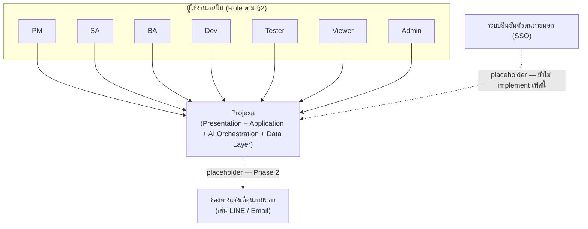
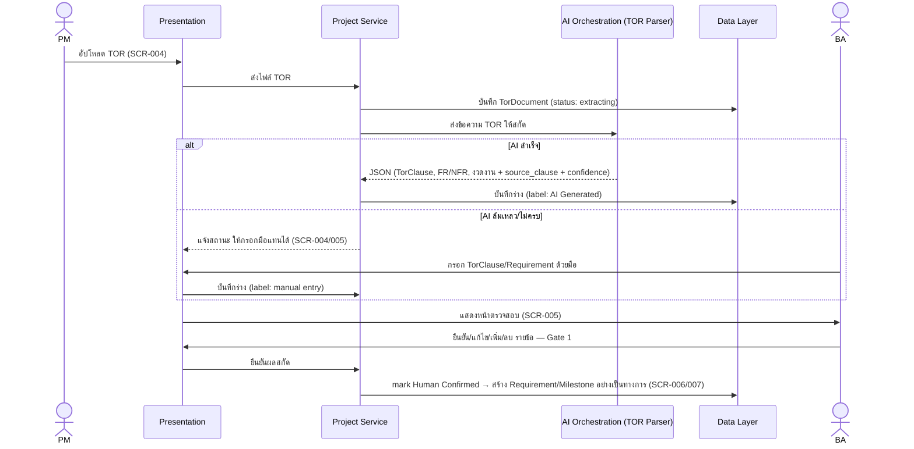
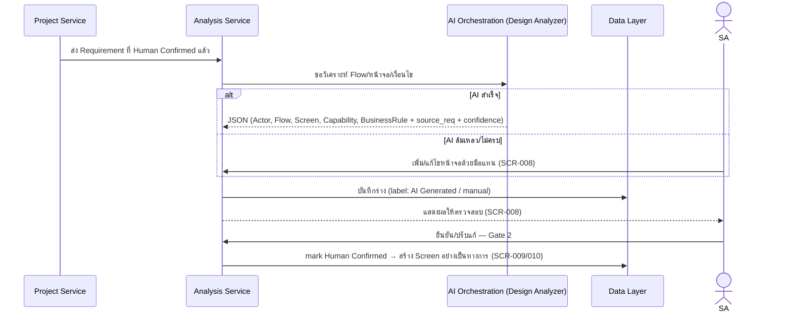
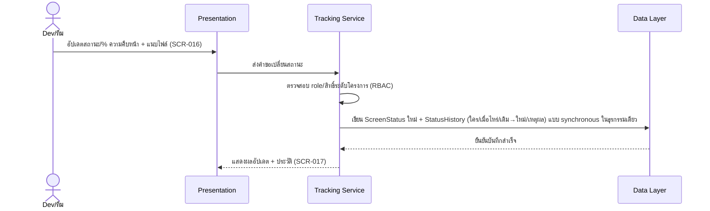
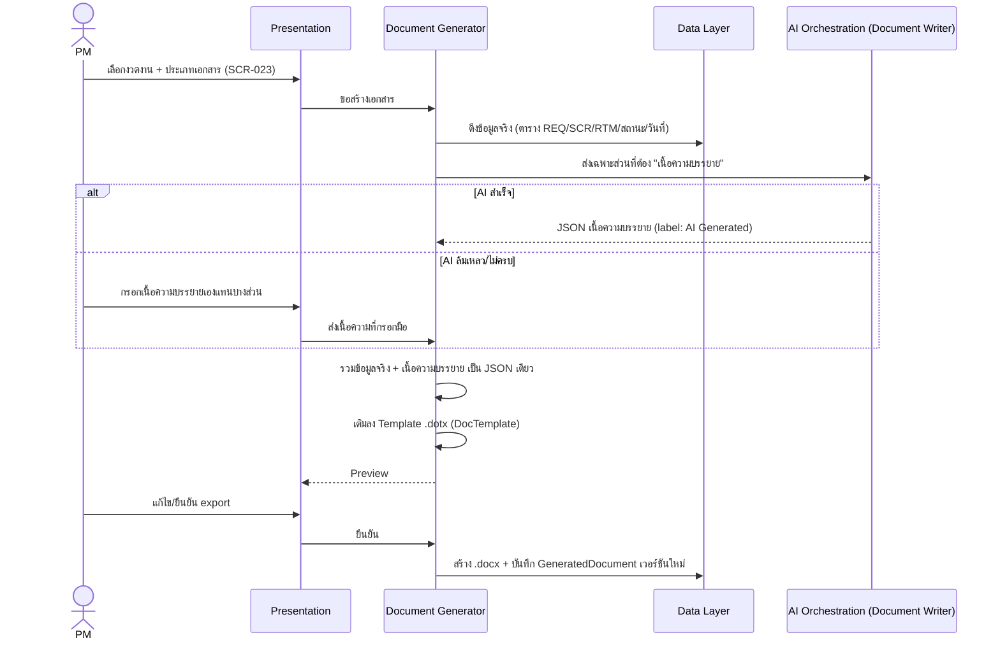

# High-Level Architecture (Conceptual) — Projexa

- **วันที่สร้าง/อัปเดตล่าสุด:** 2026-08-27
- **สถานะ:** Confirmed — ยืนยันโดย user เมื่อ 2026-08-26 (ทุก section)
- **อ้างอิงต้นทาง:** [Projexa-System-Design-R1.md](../../../Projexa-System-Design-R1.md) §3 §4 §5 §7 §8 §9,
  [[../../01-requirements/backlog|backlog]],
  [[../../01-requirements/feature-list|feature-list]],
  [[../01-prototypes/user-journey|user-journey]]

> เอกสารนี้เป็นสถาปัตยกรรมระดับสูง**เชิงแนวคิด (conceptual) เท่านั้น — ยังไม่
> ผูกมัดกับเทคโนโลยี/framework/ผลิตภัณฑ์ใดๆ** การเลือกเทคโนโลยีจริงให้ดูที่
> [[tech-stack|tech-stack.md]] (ถ้ามี) ซึ่งควรออกแบบให้สอดคล้องกับเอกสารนี้
> แต่ละหัวข้อมีสถานะ `Draft (suggested)` หรือ `Confirmed` แยกกัน — หัวข้อที่
> เป็น `Confirmed` แปลว่า user ยืนยันแล้วในเซสชันที่เกี่ยวข้อง ค่าที่ไม่มี
> ข้อมูลจริงจาก user (ประเมินแทนโดย AI ตามที่ user มอบอำนาจ) จะติดป้ายกำกับไว้
> ชัดเจนในแต่ละหัวข้อ ไม่ถือเป็นข้อเท็จจริงที่ยืนยันแล้ว

## 1. ภาพรวมและ System Boundary (Context Diagram)

- **สถานะ:** Confirmed (2026-08-26)

ไม่มีระบบภายนอกอื่นเกินกว่าที่ระบุใน §10 ของ Projexa-System-Design-R1.md (ไม่มี
legacy system ที่ต้อง migrate ข้อมูลเข้ามา) ผู้ใช้งานภายในทั้ง 7 Role ตาม §2 ใช้
งาน Projexa ผ่านช่องทางเดียว ส่วนระบบยืนยันตัวตนภายนอก (SSO) และช่องทางแจ้งเตือน
ภายนอก (เช่น LINE / Email) แสดงด้วยเส้นประเพื่อสื่อว่าเป็น**placeholder สำหรับ
อนาคต ยังไม่ implement ในเฟสนี้** ตามมติที่ user เลือก

## 2. Component/Layer Breakdown (เชิงแนวคิด)

- **สถานะ:** Confirmed (2026-08-26)

ยึด 4 layer เดิมตาม §3 ของ Projexa-System-Design-R1.md และแบ่ง Application
Layer ออกเป็น 4 service ตามเดิมตรงๆ (ไม่ใช้แนวทาง M1–M7 หรือ bounded context
แยกใหม่ — เป็นตัวเลือกที่ user ยืนยันชัดเจน)

| Component | รับผิดชอบ | ขอบเขต (นอกความรับผิดชอบ) | โมดูล/หน้าจอที่เกี่ยวข้อง (§5) | Entity หลัก (§4.1) | สถานะ |
| --- | --- | --- | --- | --- | --- |
| **Presentation Layer** | Web app แสดงผล/รับ input ทุกหน้าจอ, แสดงป้าย `AI Generated`/`Human Confirmed` | ไม่มี business logic/validation เชิงลึก | ทุกหน้าจอ (26 หน้าจอ) | — (ไม่มี entity เป็นของตัวเอง) | Confirmed (2026-08-26) |
| **Project Service** | จัดการโครงการ, นำเข้า/เก็บ TOR, ทะเบียน REQ, งวดงาน, ผู้ใช้งาน/สิทธิ์ระดับโครงการ, ข้อมูลตั้งต้นระบบ | ไม่วิเคราะห์ออกแบบหน้าจอ, ไม่สร้างเอกสาร | M1 (SCR-001–007) + M7 (SCR-025 ผู้ใช้งาน/สิทธิ์, SCR-026 ข้อมูลตั้งต้น) | Project, TorDocument, TorClause, Requirement, Milestone, DeliverableDoc, AuditLogEntry | Confirmed (2026-08-26) |
| **Analysis Service** | รับ REQ ที่ยืนยันแล้ว, ประสานงานกับ AI Design Analyzer, จัดการทะเบียนหน้าจอ/รายละเอียด/flow | ไม่จัดการสถานะการพัฒนา/ติดตามงาน | M2 (SCR-008–011) | Module, Screen, ScreenCapability, BusinessRule | Confirmed (2026-08-26) |
| **Tracking Service** | แผนงาน, มอบหมายผู้รับผิดชอบ, สถานะการพัฒนา + audit trail, ทดสอบ (Test Case/Result), Issue | ไม่สร้างเอกสารส่งมอบ | M3 (SCR-012–014) + M4 (SCR-015–018) + M5 (SCR-019–020) | Assignment, ScreenStatus, StatusHistory, Attachment, TestCase, TestResult, Issue | Confirmed (2026-08-26) |
| **Document Generator** | ดึงข้อมูลจริงจาก Data Layer, รับเนื้อความบรรยายจาก AI Document Writer, render ลง Template, จัดการเวอร์ชันเอกสาร | ไม่สร้างเนื้อความบรรยายเอง (AI ทำ), ไม่ตัดสินใจ business logic | M6 (SCR-021–024) | DocTemplate, GeneratedDocument | Confirmed (2026-08-26) |
| **AI Orchestration Layer** | TOR Parser, Design Analyzer, Test Generator, Document Writer — คืนค่า Structured JSON เท่านั้น | ห้ามเขียนข้อมูลลง Data Layer โดยตรง, ห้ามสร้างไฟล์ .docx | ครอบคลุมทุกจุดที่มี AI ใน §7.1 | — (ไม่ persist เอง) | Confirmed (2026-08-26) |
| **Data Layer** | Database + File Storage + Audit Log (Screen StatusHistory + entity-level AuditLogEntry ตาม SCR ที่กำหนด) | ไม่มี business logic | ทุก entity ใน §4.1 | ทุก Entity | Confirmed (2026-08-26) |

> **หมายเหตุ:** SCR-025/SCR-026 (M7) ไม่ได้ระบุ mapping ไว้ชัดใน §3 เดิม (§3 มี
> แค่ 4 service ไม่มี Admin service แยก) — จัดไว้ใน Project Service เพราะเป็น
> ข้อมูลระดับโครงการ/ระบบที่ Project Service ดูแลอยู่แล้วตามหลัก Single Source
> of Truth `(ประเมินแทนโดย AI ตามที่ user มอบอำนาจให้เลือกโครงสร้างตาม §3 โดย
> ไม่ได้ระบุ mapping ของ M7 ไว้)`

## 3. Data Flow ตาม User Journey

- **สถานะ:** Confirmed (2026-08-26)

### Flow A — นำเข้า TOR → ยืนยันผลสกัด (Gate 1) (อ้างอิง [[../01-prototypes/user-journey|user-journey.md]] ผัง (ก) และ persona PM/BA, §9 ของ [Projexa-System-Design-R1.md](../../../Projexa-System-Design-R1.md))

### Flow B — วิเคราะห์ออกแบบ → ยืนยันหน้าจอ (Gate 2) (อ้างอิง [[../01-prototypes/user-journey|user-journey.md]] ผัง (ก) และ persona BA/SA)

### Flow C — บันทึกความก้าวหน้า → Audit Trail (อ้างอิง [[../01-prototypes/user-journey|user-journey.md]] persona ทีม/Dev)

### Flow D — สร้างเอกสารส่งมอบ (อ้างอิง §8.1 ของ [Projexa-System-Design-R1.md](../../../Projexa-System-Design-R1.md) และ [[../01-prototypes/user-journey|user-journey.md]] persona PM ข้อ 8)

## 4. ขอบเขต AI Orchestration (เชิงแนวคิด)

- **สถานะ:** Confirmed (2026-08-26)

- ทุก AI component (TOR Parser, Design Analyzer, Test Generator, Document
  Writer) คืนค่า Structured JSON เท่านั้น ห้ามคืนข้อความอิสระหรือไฟล์เอกสาร
  (§7.2 ข้อ 1)
- ทุกรายการที่ AI เสนอต้องมีข้ออ้างอิงต้นทาง (`source_clause`/`source_req`)
  ถ้าอ้างไม่ได้ต้องติดป้าย `suggested` (§7.2 ข้อ 2)
- AI ห้ามเขียนตัวเลขเอง (ความก้าวหน้า/วันที่/จำนวนหน้าจอ) — Document Generator
  ดึงจาก Data Layer เสมอ (§7.2 ข้อ 3, §8.2)
- ทุก output ต้องผ่านหน้าจอ Review + Gate ให้คนยืนยันก่อนเข้าเป็นข้อมูลจริง
  แยกป้าย `AI Generated`/`Human Confirmed` เสมอ (§7.2 ข้อ 5)
- AI Orchestration แยกออกจาก Document Generator เด็ดขาด — AI ร่างเฉพาะเนื้อ
  ความบรรยาย ส่วนเลขอ้างอิง/ตาราง/RTM/รูปแบบเอกสาร Document Generator สร้างเอง
  100% (§8.2, §8.3)
- Resilience: ทุกจุดที่มี AI ต้องมี manual fallback path คู่ขนานเสมอ — ถ้า AI
  ล้มเหลว/ให้ผลไม่ครบ ผู้ใช้กรอกข้อมูลด้วยมือแทนได้ทันที ไม่บล็อกงาน (มติที่
  user เลือกในรอบสัมภาษณ์)

## 5. Cross-cutting Concerns

- **สถานะ:** Confirmed (2026-08-26)

- **Audit / Traceability:** บังคับเก็บ `StatusHistory` ระดับ Screen ตาม §6
  เสมอ (ผู้ทำรายการ, วันเวลา, สถานะเดิม→ใหม่, ผู้รับผิดชอบเดิม→ใหม่, เหตุผล,
  ไฟล์แนบ) นอกจากนี้ entity อื่นสามารถมี audit log ระดับ field ผ่าน
  `AuditLogEntry` ได้เมื่อ SCR นั้นกำหนดไว้ชัดเจน (ไม่บังคับทุก entity —
  ขยายตามความจำเป็นของแต่ละหน้าจอ เริ่มที่ SCR-003 ข้อมูลโครงการ 2026-08-27)
  ทั้งสองกรณีเขียนแบบ synchronous ในธุรกรรมเดียวกับการเปลี่ยนแปลงข้อมูลเสมอ
  (ไม่ eventual) เพื่อรักษาสาย `TorClause → Requirement → Screen → TestCase →
  TestResult` ให้สาวกลับได้ 100% ตาม §4.2/§13
- **Security / RBAC:** 7 Role ตาม §2 หนึ่งคนมีได้หลาย Role และกำหนดสิทธิ์ได้
  ระดับโครงการ — ทุก Application Layer service ต้องตรวจสิทธิ์ก่อนเข้าถึง/แก้ไข
  ข้อมูลเสมอ (enforce ที่ Application Layer ก่อนถึง Data Layer)
- **Multi-project isolation:** single instance เดียว ทุก entity ผูกกับ
  `Project` และทุก query ที่ Application Layer ต้อง filter ตามขอบเขตโครงการที่
  ผู้ใช้มีสิทธิ์เสมอ (logical isolation ไม่ใช่ physical/multi-tenant)
- **Consistency-first NFR:** เมื่อความสอดคล้องของข้อมูล (โดยเฉพาะสาย
  traceability) กับความเร็วในการตอบสนองขัดกัน ให้ยึด consistency ก่อนเสมอ —
  operation ที่กระทบสาย traceability ต้องเป็น synchronous/transactional
- **System boundary:** ไม่มีระบบภายนอกที่ implement จริงในเฟสนี้ SSO/ช่องทาง
  แจ้งเตือนเป็น placeholder สำหรับอนาคตเท่านั้น

## 6. เทียบกับ §3 ของ Projexa-System-Design-R1.md

ผลออกแบบรอบนี้สอดคล้องกับ §3 เดิมทั้งหมด ใช้ 4 layer และ 4 service เดิมตรงๆ
ไม่มีจุดขัดแย้ง เอกสารนี้เป็นการขยายรายละเอียด (เพิ่ม data flow, cross-cutting
concerns, system boundary) ที่ §3 ไม่เคยมี ไม่ใช่การเปลี่ยนโครงสร้าง จึงไม่มี
การแก้ไข §3 ของ Projexa-System-Design-R1.md ในรอบนี้

## การ Sync กับ Projexa-System-Design-R1.md §3

ยังไม่ sync — ไม่มีความขัดแย้งกับ §3 เดิม (ดูรายละเอียดที่หัวข้อ 6 ด้านบน)
เอกสารนี้เป็นการขยายรายละเอียดเพิ่มเติมจาก §3 เท่านั้น ไม่มีการแก้ไข §3 ของ
`Projexa-System-Design-R1.md` ในรอบนี้ตามมติของ user

## ประวัติการตัดสินใจ

- 2026-08-26: สร้างเอกสารครั้งแรก — section ที่ทำ: 1. ภาพรวมและ System Boundary
  (Context Diagram), 2. Component/Layer Breakdown, 3. Data Flow ตาม User
  Journey (Flow A–D), 4. ขอบเขต AI Orchestration, 5. Cross-cutting Concerns,
  6. เทียบกับ §3 เดิม — ทุก section สถานะ Confirmed (2026-08-26) ยืนยันโดย
  user ในรอบสัมภาษณ์เดียวกัน มติสำคัญ: component breakdown ยึด §3 เดิม (4
  layer + 4 service), multi-project แบบ single-instance logical isolation,
  audit log บังคับเฉพาะระดับ Screen, ทุกจุดที่มี AI ต้องมี manual fallback
  เสมอ, ยึด consistency-first เมื่อขัดกับ performance, SSO/ช่องทางแจ้งเตือน
  เป็น placeholder สำหรับอนาคตเท่านั้น — ไม่ sync §3 ของ
  Projexa-System-Design-R1.md เพราะไม่มีความขัดแย้ง
- 2026-08-27: sync มติจาก SCR-003 detailed design (Confirmed) เรื่อง audit
  log ระดับ entity ผ่าน AuditLogEntry เข้า §2 (เพิ่ม AuditLogEntry ในรายการ
  Entity ของ Project Service, ปรับคำอธิบาย Data Layer) และ §5 (ปรับ bullet
  Audit/Traceability ให้ไม่ปิดกั้น entity อื่นนอกเหนือจาก Screen อีกต่อไป) —
  ไม่กระทบ §3 ของ Projexa-System-Design-R1.md เพราะพูดถึง Audit Log แบบกว้าง
  อยู่แล้ว (user ยืนยันแล้ว ไม่ต้อง sync เพิ่ม)
