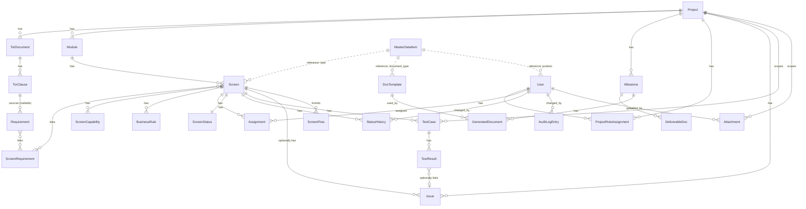

# Database Schema (Conceptual) — Projexa

- **วันที่สร้าง/อัปเดตล่าสุด:** 2026-08-27
- **สถานะ:** Draft — รอ SA/Dev Lead ยืนยันเป็นทางการ (ดูสถานะรายตารางด้านล่าง)
- **ระดับเอกสาร:** Conceptual/Logical — ชนิดข้อมูลเป็นคำเชิงแนวคิด
  (Text / Number / Boolean / DateTime / Enum / JSON-flexible / Reference)
  **ยังไม่ผูกมัดกับ DBMS หรือ ORM ใดๆ** การเลือก engine จริงอยู่ที่
  [[tech-stack|tech-stack.md]] (ถ้ามี) และต้องไม่ทำให้เอกสารนี้เปลี่ยนตาม
  การเลือกนั้น
- **อ้างอิงต้นทาง:** [Projexa-System-Design-R1.md §4](../../../Projexa-System-Design-R1.md),
  [[../../01-requirements/backlog|backlog]],
  [[../../01-requirements/01-spec/index|01-spec]]

> เอกสารนี้ขยายรายละเอียดจาก §4.1 ของเอกสารออกแบบระบบให้ครบระดับตารางและฟิลด์
> แต่ละตารางมีสถานะ `Draft (suggested)` หรือ `Confirmed` แยกกัน — ตารางที่เป็น
> `Confirmed` แปลว่า user ยืนยันแล้วในเซสชันที่เกี่ยวข้อง ค่าที่ไม่มีข้อมูล
> จริงจาก user (ประเมินแทนโดย AI ตามที่ user มอบอำนาจ) จะติดป้ายกำกับไว้
> ชัดเจน ไม่ถือเป็นข้อเท็จจริงที่ยืนยันแล้ว
>
> ทุกตารางในสาย traceability หลักและตารางอื่นส่วนใหญ่ใช้ **soft-delete**
> (`is_deleted`) ยกเว้น `StatusHistory` ซึ่งเป็น append-only log ห้ามลบ — PK
> ทุกตารางเป็น surrogate `id` (Reference) เสมอ ตารางที่มี human-readable
> code แยกฟิลด์คือ `Requirement`, `Screen`, `TestCase` เท่านั้น (ตามมติที่
> ยืนยันแล้ว)

## ER Diagram

> **หมายเหตุ:** `Attachment` เป็น polymorphic — ผูกได้กับ `Screen` /
> `StatusHistory` / `Project` / `TorDocument` / `GeneratedDocument` ผ่านคู่
> `entity_type` + `entity_id` (ไม่วาดทุกเส้นในไดอะแกรมเพื่อความอ่านง่าย ให้
> อ้างอิงคำอธิบายนี้ประกอบ diagram) `AuditLogEntry` ก็เป็น polymorphic แบบ
> เดียวกัน (ผ่าน entity_type+entity_id ไปยัง `Project`/
> `ProjectRoleAssignment`) ไม่ได้วาดทุกเส้นเช่นกัน

## บริบท/การตัดสินใจเชิงแนวคิดที่ใช้ประกอบ

ข้อมูลจริงจาก user (สัมภาษณ์และยืนยันแล้วในเซสชันของ skill `data-api-design`
วันที่ 2026-08-26):

1. **PK strategy:** Surrogate ID ทุกตาราง + เก็บ human-readable code แยกฟิลด์
   เฉพาะตารางที่มีโค้ดตามธรรมเนียมระบบ (`Requirement.code` = REQ-xxx,
   `Screen.code` = SCR-xxx, `TestCase.code` = TC-xxx — TC-xxx เป็นเลขรันนิ่ง
   ทั้งโปรเจกต์ ไม่ผูกกับ Screen ตามที่ CLAUDE.md ระบุไว้)
2. **AI result storage:** แบบผสม — คอลัมน์ปกติสำหรับ field ที่ query บ่อย
   (`ai_confidence`, `origin_label` เป็น Enum(`AIGenerated`, `HumanConfirmed`,
   `ManualEntry`), `is_suggested`) + field แบบยืดหยุ่น (`JSON-flexible`) ชื่อ
   `ai_extra` สำหรับ raw output อื่นที่ AI คืนมา
3. **Delete policy:** Soft-delete (`is_deleted` เป็น Boolean) กับทุกตารางหลัก
   ในสาย traceability และตารางอื่นส่วนใหญ่ ยกเว้น `StatusHistory` ซึ่งเป็น
   append-only log ห้ามลบ (ไม่มี `is_deleted`)
4. **GeneratedDocument versioning:** มีสถานะ `Draft` (แก้ไขทับได้ก่อน export)
   → พอ export แล้ว snapshot เป็นเวอร์ชันใหม่ (`version_no` เพิ่มขึ้น, สถานะ
   `Exported`) ที่แก้ไม่ได้อีก (immutable)

## รายการตาราง (Entities)

> **หมายเหตุ:** สถานะตารางส่วนใหญ่ยังเป็น `Draft (suggested)` ตามมติเดิมของ
> user — ยกเว้น `AuditLogEntry` ซึ่ง Confirmed แล้วเมื่อ 2026-08-27 (sync มา
> จาก [[detailed-design/scr-003-ข้อมูลโครงการ|SCR-003 detailed design]])

### M1 — จัดการโครงการและ TOR

#### Project

- **สถานะ:** Draft (suggested)
- **คำอธิบาย:** ข้อมูลโครงการ
- **ใช้งานโดยหน้าจอ:** SCR-001, SCR-002, SCR-003, SCR-004, SCR-005, SCR-006,
  SCR-007 (และเป็น scope หลักของทุกหน้าจอในระบบ)

| ฟิลด์ | ชนิดข้อมูล (conceptual) | Key | Nullable | คำอธิบาย |
|---|---|---|---|---|
| id | Reference | PK | ไม่ | |
| name | Text | | ไม่ | ชื่อโครงการ |
| customer_name | Text | | ไม่ | ลูกค้า |
| start_date | DateTime | | ไม่ | วันเริ่มโครงการ |
| end_date | DateTime | | ไม่ | วันสิ้นสุดโครงการ |
| budget | Number | | ได้ | งบประมาณ |
| status | Enum(Active/OnHold/Closed) | | ไม่ | ใช้กรองใน SCR-002 |
| is_deleted | Boolean | | ไม่ (default false) | soft-delete |

**ความสัมพันธ์:** มี `TorDocument`, `Module`, `Milestone`,
`ProjectRoleAssignment`, `Issue` หลายรายการ; scope ของ `TestCase` และ
`Attachment`

#### TorDocument

- **สถานะ:** Draft (suggested)
- **คำอธิบาย:** ไฟล์ TOR ต้นฉบับ + สถานะการสกัด
- **ใช้งานโดยหน้าจอ:** SCR-004, SCR-005

| ฟิลด์ | ชนิดข้อมูล (conceptual) | Key | Nullable | คำอธิบาย |
|---|---|---|---|---|
| id | Reference | PK | ไม่ | |
| project_id | Reference→Project | FK | ไม่ | |
| file_reference | Reference (File Storage metadata: name/key/mime/size) | | ได้ | nullable กรณีกรอกเนื้อหาเองไม่มีไฟล์ |
| raw_text | Text | | ได้ | เนื้อหา TOR กรณีกรอกเอง |
| extraction_status | Enum(Pending/Extracting/Done/Failed) | | ไม่ | แสดงบน SCR-004 |
| extraction_job_id | Text/Reference | | ได้ | เชื่อม async job ของ AI TOR Parser |
| uploaded_by | Reference→User | FK | ไม่ | |
| uploaded_at | DateTime | | ไม่ | |
| is_deleted | Boolean | | ไม่ (default false) | |

**ความสัมพันธ์:** belongs to `Project`; มี `TorClause` หลายรายการ

#### TorClause

- **สถานะ:** Draft (suggested)
- **คำอธิบาย:** ข้อย่อยใน TOR (เลขข้อ, เนื้อหา, เลขหน้า)
- **ใช้งานโดยหน้าจอ:** SCR-004, SCR-005, SCR-006 (ลิงก์อ้างอิง)

| ฟิลด์ | ชนิดข้อมูล (conceptual) | Key | Nullable | คำอธิบาย |
|---|---|---|---|---|
| id | Reference | PK | ไม่ | |
| tor_document_id | Reference→TorDocument | FK | ไม่ | |
| clause_no | Text | | ไม่ | เลขข้อใน TOR เช่น "3.2.1" |
| page_no | Number | | ได้ | |
| content | Text | | ไม่ | |
| is_deleted | Boolean | | ไม่ (default false) | |

**ความสัมพันธ์:** belongs to `TorDocument`; เป็นต้นทาง (nullable) ของ
`Requirement`

#### Requirement

- **สถานะ:** Draft (suggested)
- **คำอธิบาย:** ความต้องการ REQ-xxx (FR/NFR)
- **ใช้งานโดยหน้าจอ:** SCR-005, SCR-006, SCR-008 (เป็น input)

| ฟิลด์ | ชนิดข้อมูล (conceptual) | Key | Nullable | คำอธิบาย |
|---|---|---|---|---|
| id | Reference | PK | ไม่ | |
| code | Text (unique ต่อ Project) | | ไม่ | REQ-014 |
| project_id | Reference→Project | FK | ไม่ | denormalize เพื่อ scope filter |
| tor_clause_id | Reference→TorClause | FK | ได้ | |
| type | Enum(FR/NFR) | | ไม่ | |
| title | Text | | ไม่ | |
| description | Text | | ไม่ | |
| ai_confidence | Number | | ได้ | จาก TOR Parser |
| ai_extra | JSON-flexible | | ได้ | raw AI payload ส่วนที่ไม่ normalize |
| origin_label | Enum(AIGenerated/HumanConfirmed/ManualEntry) | | ไม่ | |
| is_suggested | Boolean | | ไม่ (default false) | เมื่ออ้างอิงต้นทางไม่ได้ |
| status | Enum(Draft/Confirmed) | | ไม่ | Gate 1 |
| confirmed_by | Reference→User | FK | ได้ | |
| confirmed_at | DateTime | | ได้ | |
| is_deleted | Boolean | | ไม่ (default false) | |

**ความสัมพันธ์:** อ้าง `TorClause` (nullable); เชื่อมกับ `Screen` ผ่าน
`ScreenRequirement` แบบ many-to-many

#### Milestone

- **สถานะ:** Draft (suggested)
- **คำอธิบาย:** งวดงาน (ชื่อ, วันครบกำหนด, % ชำระเงิน)
- **ใช้งานโดยหน้าจอ:** SCR-007, SCR-012, SCR-023

| ฟิลด์ | ชนิดข้อมูล (conceptual) | Key | Nullable | คำอธิบาย |
|---|---|---|---|---|
| id | Reference | PK | ไม่ | |
| project_id | Reference→Project | FK | ไม่ | |
| name | Text | | ไม่ | |
| due_date | DateTime | | ไม่ | |
| payment_percentage | Number | | ได้ | optional ตาม spec |
| is_deleted | Boolean | | ไม่ (default false) | |

**ความสัมพันธ์:** belongs to `Project`; มี `DeliverableDoc`,
`GeneratedDocument` หลายรายการ

#### DeliverableDoc

- **สถานะ:** Draft (suggested)
- **คำอธิบาย:** เอกสารที่ต้องส่งในงวดนั้น (REQ/SDD/TSC/User Manual)
- **ใช้งานโดยหน้าจอ:** SCR-007, SCR-023

| ฟิลด์ | ชนิดข้อมูล (conceptual) | Key | Nullable | คำอธิบาย |
|---|---|---|---|---|
| id | Reference | PK | ไม่ | |
| milestone_id | Reference→Milestone | FK | ไม่ | |
| document_type | Reference→MasterDataItem (category=DocumentType) | FK | ไม่ | |
| is_deleted | Boolean | | ไม่ (default false) | |

**ความสัมพันธ์:** belongs to `Milestone`; อ้าง `MasterDataItem`
(category=DocumentType)

### M2 — วิเคราะห์และออกแบบ

#### Module

- **สถานะ:** Draft (suggested)
- **คำอธิบาย:** กลุ่มงาน/โมดูลของระบบที่จะพัฒนา
- **ใช้งานโดยหน้าจอ:** SCR-009, SCR-010

| ฟิลด์ | ชนิดข้อมูล (conceptual) | Key | Nullable | คำอธิบาย |
|---|---|---|---|---|
| id | Reference | PK | ไม่ | |
| project_id | Reference→Project | FK | ไม่ | |
| name | Text | | ไม่ | |
| description | Text | | ได้ | |
| is_deleted | Boolean | | ไม่ (default false) | |

**ความสัมพันธ์:** belongs to `Project`; มี `Screen` หลายรายการ

#### Screen

- **สถานะ:** Draft (suggested)
- **คำอธิบาย:** หน้าจอ SCR-xxx (ชื่อ, ประเภท, คำอธิบาย)
- **ใช้งานโดยหน้าจอ:** SCR-008, SCR-009, SCR-010, SCR-011, SCR-013, SCR-015,
  SCR-016, SCR-017, SCR-019

| ฟิลด์ | ชนิดข้อมูล (conceptual) | Key | Nullable | คำอธิบาย |
|---|---|---|---|---|
| id | Reference | PK | ไม่ | |
| code | Text (unique ต่อ Project) | | ไม่ | SCR-009 style code |
| module_id | Reference→Module | FK | ไม่ | |
| name | Text | | ไม่ | |
| description | Text | | ไม่ | |
| type | Reference→MasterDataItem (category=ScreenType) | FK | ไม่ | |
| ai_confidence | Number | | ได้ | จาก Design Analyzer |
| ai_extra | JSON-flexible | | ได้ | |
| origin_label | Enum(AIGenerated/HumanConfirmed/ManualEntry) | | ไม่ | |
| is_suggested | Boolean | | ไม่ (default false) | |
| status | Enum(Draft/Confirmed) | | ไม่ | Gate 2 |
| confirmed_by | Reference→User | FK | ได้ | SA |
| confirmed_at | DateTime | | ได้ | |
| is_deleted | Boolean | | ไม่ (default false) | |

**ความสัมพันธ์:** belongs to `Module`; เชื่อมกับ `Requirement` ผ่าน
`ScreenRequirement`; อ้าง `MasterDataItem` (category=ScreenType); มี
`ScreenCapability`, `BusinessRule`, `Assignment`, `TestCase` หลายรายการ; มี
`ScreenStatus` แบบ 1:1; มี `StatusHistory` หลายรายการ; อาจมี `Issue`
เกี่ยวข้อง; เป็น endpoint (from/to) ของ `ScreenFlow`

#### ScreenRequirement (ตารางเชื่อม)

- **สถานะ:** Draft (suggested)
- **คำอธิบาย:** ตารางเชื่อม (junction) ระหว่าง Screen และ Requirement แบบ
  many-to-many
- **ใช้งานโดยหน้าจอ:** SCR-006, SCR-008, SCR-010

| ฟิลด์ | ชนิดข้อมูล (conceptual) | Key | Nullable | คำอธิบาย |
|---|---|---|---|---|
| id | Reference | PK | ไม่ | |
| screen_id | Reference→Screen | FK | ไม่ | |
| requirement_id | Reference→Requirement | FK | ไม่ | |

**ความสัมพันธ์:** เชื่อม `Screen` กับ `Requirement`

#### ScreenCapability

- **สถานะ:** Draft (suggested)
- **คำอธิบาย:** ความสามารถของหน้าจอ (เพิ่ม/แก้/ลบ/ค้นหา/พิมพ์/อนุมัติ)
- **ใช้งานโดยหน้าจอ:** SCR-008, SCR-010

| ฟิลด์ | ชนิดข้อมูล (conceptual) | Key | Nullable | คำอธิบาย |
|---|---|---|---|---|
| id | Reference | PK | ไม่ | |
| screen_id | Reference→Screen | FK | ไม่ | |
| capability_type | Enum(Create/Read/Update/Delete/Search/Print/Approve/Other) | | ไม่ | |
| description | Text | | ได้ | |
| is_deleted | Boolean | | ไม่ (default false) | |

**ความสัมพันธ์:** belongs to `Screen`

#### BusinessRule

- **สถานะ:** Draft (suggested)
- **คำอธิบาย:** เงื่อนไขการทำงาน/validation
- **ใช้งานโดยหน้าจอ:** SCR-008, SCR-010, SCR-019 (เป็น input ของ Test
  Generator)

| ฟิลด์ | ชนิดข้อมูล (conceptual) | Key | Nullable | คำอธิบาย |
|---|---|---|---|---|
| id | Reference | PK | ไม่ | |
| screen_id | Reference→Screen | FK | ไม่ | |
| rule_text | Text | | ไม่ | |
| is_deleted | Boolean | | ไม่ (default false) | |

**ความสัมพันธ์:** belongs to `Screen`; ใช้ประกอบการสร้าง `TestCase`

#### ScreenFlow

- **สถานะ:** Draft (suggested)
- **คำอธิบาย:** เส้นเชื่อม (edge) ระหว่างหน้าจอสำหรับผัง Flow (SCR-011)
- **ใช้งานโดยหน้าจอ:** SCR-011

| ฟิลด์ | ชนิดข้อมูล (conceptual) | Key | Nullable | คำอธิบาย |
|---|---|---|---|---|
| id | Reference | PK | ไม่ | |
| from_screen_id | Reference→Screen | FK | ไม่ | |
| to_screen_id | Reference→Screen | FK | ไม่ | |
| description | Text | | ได้ | เงื่อนไขการเชื่อมโยง |
| is_deleted | Boolean | | ไม่ (default false) | |

**ความสัมพันธ์:** เชื่อม `Screen` (from) กับ `Screen` (to)

### M3 — วางแผนและมอบหมายงาน

#### Assignment

- **สถานะ:** Draft (suggested)
- **คำอธิบาย:** ผู้รับผิดชอบ (Screen × Role × User)
- **ใช้งานโดยหน้าจอ:** SCR-013, SCR-017

| ฟิลด์ | ชนิดข้อมูล (conceptual) | Key | Nullable | คำอธิบาย |
|---|---|---|---|---|
| id | Reference | PK | ไม่ | |
| screen_id | Reference→Screen | FK | ไม่ | |
| user_id | Reference→User | FK | ไม่ | |
| role | Enum(SA/BA/Dev/Tester) | | ไม่ | |
| assigned_by | Reference→User | FK | ไม่ | |
| assigned_at | DateTime | | ไม่ | |
| is_deleted | Boolean | | ไม่ (default false) | |

**ความสัมพันธ์:** belongs to `Screen`; อ้าง `User`

### M4 — ติดตามการดำเนินงาน

#### ScreenStatus

- **สถานะ:** Draft (suggested)
- **คำอธิบาย:** สถานะปัจจุบัน + วันที่วางแผน/จริง
- **ใช้งานโดยหน้าจอ:** SCR-015, SCR-016, SCR-017

| ฟิลด์               | ชนิดข้อมูล (conceptual)                                                          | Key | Nullable        | คำอธิบาย |
| ------------------- | -------------------------------------------------------------------------------- | --- | --------------- | -------- |
| id                  | Reference                                                                        | PK  | ไม่             |          |
| screen_id           | Reference→Screen (1:1 unique)                                                    | FK  | ไม่             |          |
| current_status      | Enum(NotStarted/Analysis/Design/Development/UnitTest/SIT/UAT/Done/OnHold/Rework) |     | ไม่             | §6       |
| planned_start_date  | DateTime                                                                         |     | ได้             |          |
| planned_end_date    | DateTime                                                                         |     | ได้             |          |
| actual_start_date   | DateTime                                                                         |     | ได้             |          |
| actual_end_date     | DateTime                                                                         |     | ได้             |          |
| progress_percentage | Number                                                                           |     | ไม่ (default 0) |          |
| updated_at          | DateTime                                                                         |     | ไม่             |          |

**ความสัมพันธ์:** belongs to `Screen` (1:1)

#### StatusHistory

- **สถานะ:** Draft (suggested)
- **คำอธิบาย:** ประวัติทุกการเปลี่ยนสถานะและผู้รับผิดชอบ — audit trail
  แบบ append-only ห้ามลบ (**ไม่มีฟิลด์ `is_deleted`**)
- **ใช้งานโดยหน้าจอ:** SCR-016, SCR-017, SCR-023 (เป็น input รายงาน
  ความก้าวหน้า)

| ฟิลด์ | ชนิดข้อมูล (conceptual) | Key | Nullable | คำอธิบาย |
|---|---|---|---|---|
| id | Reference | PK | ไม่ | |
| screen_id | Reference→Screen | FK | ไม่ | |
| changed_by | Reference→User | FK | ไม่ | |
| changed_at | DateTime | | ไม่ | |
| old_status | Enum | | ไม่ | |
| new_status | Enum | | ไม่ | |
| old_assignee_id | Reference→User | FK | ได้ | |
| new_assignee_id | Reference→User | FK | ได้ | |
| reason | Text | | required เมื่อเลื่อนวัน/ถอยสถานะ (บังคับที่ Application Layer) | |
| note | Text | | ได้ | |
| progress_percentage_snapshot | Number | | ได้ | |

**ความสัมพันธ์:** audit trail ของ `Screen`; อ้าง `User` (`changed_by`,
`old_assignee_id`, `new_assignee_id`)

#### AuditLogEntry

- **สถานะ:** Confirmed (2026-08-27)
- **คำอธิบาย:** ประวัติการเปลี่ยนแปลงข้อมูลของ entity ต่างๆ ในระบบ (นอกเหนือจาก
  Screen ซึ่งมี StatusHistory อยู่แล้ว) ตามหลัก "Everything is logged" —
  ออกแบบครั้งแรกที่ [[detailed-design/scr-003-ข้อมูลโครงการ|SCR-003 detailed design]]
  แล้ว sync เข้าที่นี่
- **ใช้งานโดยหน้าจอ:** SCR-003 (เริ่มต้น) — pattern เดียวกันนี้ใช้ซ้ำได้กับ
  SCR อื่นในอนาคตที่ต้องการ audit log ระดับ field

| ฟิลด์ | ชนิดข้อมูล (conceptual) | Key | Nullable | คำอธิบาย |
|---|---|---|---|---|
| id | Reference | PK | ไม่ | |
| entity_type | Enum(Project, ProjectRoleAssignment) | | ไม่ | ประเภท entity ที่ถูกบันทึกประวัติ — ขยาย Enum เพิ่มได้เมื่อมี SCR อื่นต้องการ audit log แบบเดียวกัน |
| entity_id | Reference | | ไม่ | อ้างอิงแถวของ entity_type นั้น (polymorphic reference คล้าย `Attachment`) |
| field_name | Text | | ได้ | ชื่อฟิลด์ที่เปลี่ยน (null สำหรับ action ที่ไม่ใช่แก้ฟิลด์เดี่ยว เช่น เพิ่ม/ลบทีมงาน) |
| old_value | JSON-flexible | | ได้ | ค่าก่อนแก้ไข (null ตอน action=Create/AddTeamMember) |
| new_value | JSON-flexible | | ได้ | ค่าหลังแก้ไข (null ตอน action=RemoveTeamMember) |
| changed_by | Reference→User | FK | ไม่ | |
| changed_at | DateTime | | ไม่ | |
| action | Enum(Create, Update, AddTeamMember, RemoveTeamMember) | | ไม่ | |

**ความสัมพันธ์:** append-only log ห้ามลบ (ไม่มีฟิลด์ `is_deleted` — ตามแนวทาง
เดียวกับ `StatusHistory`); อ้าง `User` (`changed_by`); polymorphic reference
ไปยัง entity ต่างๆ ผ่าน `entity_type`+`entity_id` (เหมือน `Attachment`)

#### Issue

- **สถานะ:** Draft (suggested)
- **คำอธิบาย:** ปัญหาและแนวทางแก้ไข
- **ใช้งานโดยหน้าจอ:** SCR-018, SCR-020

| ฟิลด์ | ชนิดข้อมูล (conceptual) | Key | Nullable | คำอธิบาย |
|---|---|---|---|---|
| id | Reference | PK | ไม่ | |
| project_id | Reference→Project | FK | ไม่ | |
| screen_id | Reference→Screen | FK | ได้ | |
| title | Text | | ไม่ | |
| description | Text | | ไม่ | |
| impact | Text | | ไม่ | |
| resolution | Text | | ได้ | |
| status | Enum(Open/InProgress/Resolved/Closed) | | ไม่ | |
| assigned_to | Reference→User | FK | ได้ | |
| reported_by | Reference→User | FK | ไม่ | |
| reported_at | DateTime | | ไม่ | |
| is_deleted | Boolean | | ไม่ (default false) | |

**ความสัมพันธ์:** อ้าง `Screen` (nullable) หรือ `Project`; อ้าง `User`
(`assigned_to`, `reported_by`); อาจถูกอ้างโดย `TestResult`

### M5 — จัดการการทดสอบ

#### TestCase

- **สถานะ:** Draft (suggested)
- **คำอธิบาย:** TC-xxx (เงื่อนไข, ขั้นตอน, ผลคาดหวัง)
- **ใช้งานโดยหน้าจอ:** SCR-019, SCR-020

| ฟิลด์ | ชนิดข้อมูล (conceptual) | Key | Nullable | คำอธิบาย |
|---|---|---|---|---|
| id | Reference | PK | ไม่ | |
| code | Text (unique ต่อ Project, รันนิ่งทั้งโปรเจกต์ไม่ผูกกับ Screen) | | ไม่ | TC-041 |
| screen_id | Reference→Screen | FK | ไม่ | |
| condition | Text | | ไม่ | |
| steps | JSON-flexible (list ขั้นตอน) | | ไม่ | |
| expected_result | Text | | ไม่ | |
| ai_confidence | Number | | ได้ | |
| ai_extra | JSON-flexible | | ได้ | |
| origin_label | Enum(AIGenerated/HumanConfirmed/ManualEntry) | | ไม่ | |
| confirmed_by | Reference→User | FK | ได้ | Tester |
| is_deleted | Boolean | | ไม่ (default false) | |

**ความสัมพันธ์:** อ้าง `Screen`; code (`TC-xxx`) เป็นเลขรันนิ่งทั้งโปรเจกต์
ตามมติที่ 1; มี `TestResult` หลายรายการ

#### TestResult

- **สถานะ:** Draft (suggested)
- **คำอธิบาย:** ผลการทดสอบแต่ละรอบ
- **ใช้งานโดยหน้าจอ:** SCR-020, SCR-018

| ฟิลด์ | ชนิดข้อมูล (conceptual) | Key | Nullable | คำอธิบาย |
|---|---|---|---|---|
| id | Reference | PK | ไม่ | |
| test_case_id | Reference→TestCase | FK | ไม่ | |
| round_no | Number | | ไม่ | |
| result | Enum(Pass/Fail) | | ไม่ | |
| tested_by | Reference→User | FK | ไม่ | |
| tested_at | DateTime | | ไม่ | |
| issue_id | Reference→Issue | FK | ได้ | |
| is_deleted | Boolean | | ไม่ (default false) | |

**ความสัมพันธ์:** belongs to `TestCase`; อ้างถึง `Issue` ที่พบ (nullable)

### M6 — จัดการเอกสาร

#### Attachment (polymorphic)

- **สถานะ:** Draft (suggested)
- **คำอธิบาย:** ไฟล์แนบ ผูกกับหน้าจอ + ขั้นตอน — เป็น polymorphic ผูกได้กับ
  หลาย entity ผ่านคู่ `entity_type` + `entity_id`
- **ใช้งานโดยหน้าจอ:** SCR-004, SCR-016, SCR-021, SCR-022

| ฟิลด์ | ชนิดข้อมูล (conceptual) | Key | Nullable | คำอธิบาย |
|---|---|---|---|---|
| id | Reference | PK | ไม่ | |
| entity_type | Enum(Project/TorDocument/Screen/StatusHistory/GeneratedDocument) | | ไม่ | |
| entity_id | Reference (generic) | | ไม่ | |
| file_reference | Reference (File Storage metadata) | | ไม่ | |
| uploaded_by | Reference→User | FK | ไม่ | |
| uploaded_at | DateTime | | ไม่ | |
| is_deleted | Boolean | | ไม่ (default false) | |

**ความสัมพันธ์:** belongs to `Screen`/`StatusHistory`/`Project`/
`TorDocument`/`GeneratedDocument` (polymorphic ผ่าน entity_type+entity_id);
อ้าง `User` (`uploaded_by`)

#### DocTemplate

- **สถานะ:** Draft (suggested)
- **คำอธิบาย:** แม่แบบเอกสาร .dotx + placeholder mapping
- **ใช้งานโดยหน้าจอ:** SCR-022, SCR-023

| ฟิลด์ | ชนิดข้อมูล (conceptual) | Key | Nullable | คำอธิบาย |
|---|---|---|---|---|
| id | Reference | PK | ไม่ | |
| name | Text | | ไม่ | |
| document_type | Reference→MasterDataItem (category=DocumentType) | FK | ไม่ | |
| file_reference | Reference (.dotx metadata) | | ไม่ | |
| placeholder_mapping | JSON-flexible (list {placeholder, data_path}) | | ไม่ | |
| is_active | Boolean | | ไม่ (default true) | |
| is_deleted | Boolean | | ไม่ (default false) | |

**ความสัมพันธ์:** ระดับองค์กร; อ้าง `MasterDataItem` (category=DocumentType);
มี `GeneratedDocument` หลายรายการ

#### GeneratedDocument

- **สถานะ:** Draft (suggested)
- **คำอธิบาย:** เอกสารที่ระบบสร้าง (เวอร์ชัน, งวด, ผู้สร้าง) — สถานะ `Draft`
  แก้ไขทับได้ก่อน export → export แล้ว snapshot เป็นเวอร์ชันใหม่
  (`version_no` เพิ่มขึ้น, สถานะ `Exported`) แก้ไม่ได้อีก (immutable) ตามมติ
  ที่ 4
- **ใช้งานโดยหน้าจอ:** SCR-023, SCR-024

| ฟิลด์ | ชนิดข้อมูล (conceptual) | Key | Nullable | คำอธิบาย |
|---|---|---|---|---|
| id | Reference | PK | ไม่ | |
| milestone_id | Reference→Milestone | FK | ไม่ | |
| doc_template_id | Reference→DocTemplate | FK | ไม่ | |
| version_no | Number | | ไม่ | running ต่อ milestone+document_type |
| status | Enum(Draft/Exported) | | ไม่ | Draft แก้ทับได้, Exported = immutable snapshot |
| content_snapshot | JSON-flexible (ข้อมูลจริง+เนื้อความบรรยาย AI รวมกัน) | | ไม่ | |
| ai_narrative_confidence | Number | | ได้ | |
| file_reference | Reference (.docx metadata) | | ได้ (จนกว่า export) | |
| generated_by | Reference→User | FK | ไม่ | |
| generated_at | DateTime | | ไม่ | |
| is_deleted | Boolean | | ไม่ (default false) | |

**ความสัมพันธ์:** อ้าง `Milestone` + `DocTemplate`

### M7 — ผู้ดูแลระบบ

#### User

- **สถานะ:** Draft (suggested)
- **คำอธิบาย:** ผู้ใช้งานของระบบ (คนจริง)
- **ใช้งานโดยหน้าจอ:** SCR-025, SCR-013 (assignee), SCR-016 (actor)

| ฟิลด์ | ชนิดข้อมูล (conceptual) | Key | Nullable | คำอธิบาย |
|---|---|---|---|---|
| id | Reference | PK | ไม่ | |
| name | Text | | ไม่ | |
| email | Text (unique) | | ไม่ | |
| position | Reference→MasterDataItem (category=JobTitle) | FK | ได้ | |
| is_active | Boolean | | ไม่ (default true) | |
| is_deleted | Boolean | | ไม่ (default false) | |

**ความสัมพันธ์:** ถูกอ้างโดยหลาย entity ในฐานะผู้ทำรายการ/ผู้รับผิดชอบ/ผู้
ยืนยัน; มี `ProjectRoleAssignment`, `Assignment` หลายรายการ; ถูกอ้างโดย
`StatusHistory` (`changed_by`), `Attachment` (`uploaded_by`); อ้าง
`MasterDataItem` (category=JobTitle) สำหรับ position

#### ProjectRoleAssignment

- **สถานะ:** Draft (suggested)
- **คำอธิบาย:** การกำหนด Role ให้ User ระดับโครงการ (รองรับ 1 user หลาย Role
  ตาม §2)
- **ใช้งานโดยหน้าจอ:** SCR-025

| ฟิลด์ | ชนิดข้อมูล (conceptual) | Key | Nullable | คำอธิบาย |
|---|---|---|---|---|
| id | Reference | PK | ไม่ | |
| project_id | Reference→Project | FK | ไม่ | |
| user_id | Reference→User | FK | ไม่ | |
| role | Enum(PM/SA/BA/Dev/Tester/Viewer/Admin) | | ไม่ | 1 user มีได้หลาย row/role |
| assigned_by | Reference→User | FK | ไม่ | |
| assigned_at | DateTime | | ไม่ | |
| is_deleted | Boolean | | ไม่ (default false) | |

**ความสัมพันธ์:** belongs to `Project` และ `User` — ใช้เป็นฐานของการตรวจ
สิทธิ์ระดับโครงการ (permission model ตามมติที่ 11)

#### MasterDataItem

- **สถานะ:** Draft (suggested)
- **คำอธิบาย:** ข้อมูลตั้งต้นกลาง (ประเภทเอกสาร/ประเภทหน้าจอ/สถานะ/
  ตำแหน่งงาน แยกด้วย category)
- **ใช้งานโดยหน้าจอ:** SCR-026, SCR-010 (type), SCR-022 (document_type)

| ฟิลด์ | ชนิดข้อมูล (conceptual) | Key | Nullable | คำอธิบาย |
|---|---|---|---|---|
| id | Reference | PK | ไม่ | |
| category | Enum(DocumentType/ScreenType/ScreenStatusType/JobTitle) | | ไม่ | |
| code | Text | | ไม่ | |
| label | Text | | ไม่ | |
| is_active | Boolean | | ไม่ (default true) | |
| is_deleted | Boolean | | ไม่ (default false) | |

**ความสัมพันธ์:** ถูกอ้างโดย `Screen` (type), `DocTemplate`
(document_type), `User` (position), `DeliverableDoc` (document_type)

## ประวัติการตัดสินใจ

- 2026-08-26: สร้างเอกสารครั้งแรก — ระบุสโคปครบ 24 ตาราง (19 ตารางเดิมจาก
  §4.1 + 5 ตารางใหม่: `User`, `ProjectRoleAssignment`, `MasterDataItem`,
  `ScreenRequirement`, `ScreenFlow`) ทุกตารางสถานะ `Draft (suggested)` ตาม
  มติของ user บันทึกบริบท/การตัดสินใจเชิงแนวคิด 4 ข้อที่ยืนยันแล้ว (PK
  strategy, AI result storage, delete policy, GeneratedDocument versioning)
  แต่ ER Diagram และรายละเอียดฟิลด์ยังไม่ครบเนื่องจากยังไม่ได้รับเนื้อหา
  ฉบับเต็มจากผู้เรียก
- 2026-08-26 (รอบ 2): ผู้เรียกส่งเนื้อหาฉบับเต็มที่ user ยืนยันแล้วมาให้ —
  เติม ER Diagram (mermaid, ครบ 24 ตาราง) และรายละเอียดฟิลด์ครบทุกตาราง
  (24 ตาราง) พร้อม mapping "ใช้งานโดยหน้าจอ" ต่อตาราง แทนที่ `TODO` ทั้งหมด
  เรียบร้อยแล้ว ทุกตารางยังคงสถานะ `Draft (suggested)` ตามเดิม (ยังไม่มี
  ตารางใดเป็น `Confirmed`)
- 2026-08-27: sync มติจาก [[detailed-design/scr-003-ข้อมูลโครงการ|SCR-003
  detailed design]] (Confirmed) — เพิ่มตารางใหม่ `AuditLogEntry` (สถานะ
  `Confirmed`, 25 ตารางรวม) เป็น polymorphic append-only log ผ่าน
  entity_type+entity_id (ปัจจุบันครอบคลุม `Project`, `ProjectRoleAssignment`)
  อัปเดต ER Diagram เพิ่มเส้น `User ||--o{ AuditLogEntry` และหมายเหตุ
  polymorphic ประกอบ diagram ตารางอื่นทั้งหมดยังคงสถานะเดิมไม่ถูกแตะต้อง
