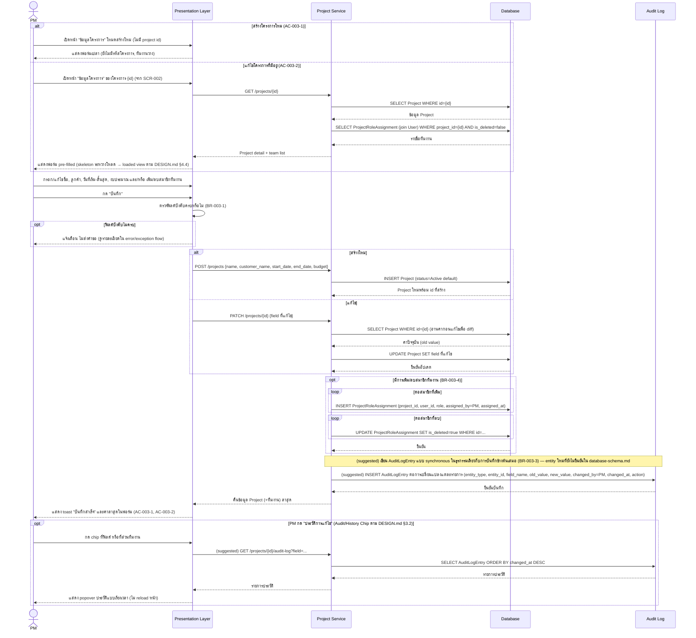

# Detailed Design — SCR-003 ข้อมูลโครงการ

- **วันที่สร้าง/อัปเดตล่าสุด:** 2026-08-27
- **สถานะ:** Confirmed (2026-08-27) — SA ตรวจทานและยืนยันเอกสารทั้งฉบับแล้ว รวมจุด suggested ทั้ง 2 จุด (ดู §6)
- **โมดูล:** M1 — จัดการโครงการและ TOR
- **อ้างอิง Requirement:** [[../../../01-requirements/01-spec/20260824-003-scr-003-ข้อมูลโครงการ|SCR-003]]
- **อ้างอิง Tech Stack:** ยังไม่มีเอกสาร tech-stack.md ณ วันที่เขียน — ใช้ชื่อ layer ทั่วไปตาม Projexa-System-Design-R1.md §3
- **อ้างอิง Prototype:** [SCR-003 prototype](../../01-prototypes/v1/scr-003.html)
- **อ้างอิง Acceptance Criteria:** [[../../../03-testing/01-test-plan/acceptance-criteria|acceptance-criteria]]#scr-003-ข้อมูลโครงการ
- **AI Component เกี่ยวข้อง:** ไม่มี — SCR-003 ไม่อยู่ในตาราง §7.1 ของ Projexa-System-Design-R1.md เป็นหน้าจอ CRUD ล้วน ไม่มี step เกี่ยวกับ AI/JSON/Human-in-the-loop gate สำหรับ AI ใน sequence diagram นี้

> เอกสารนี้เป็น **Conceptual Design ระดับหน้าจอ/ฟีเจอร์** ต่างจาก
> [[../tech-stack|tech-stack.md]] ที่เป็นการตัดสินใจเทคโนโลยีระดับระบบ
> เป็นพิมพ์เขียวสำหรับตอนลงมือเขียนโค้ดจริงและฐานของ SDD ในเฟสถัดไป (ดู
> [Projexa-System-Design-R1.md](../../../../Projexa-System-Design-R1.md) §10)

## 1. ภาพรวมเชิงแนวคิด (Conceptual Design)

- **Actor ที่เกี่ยวข้อง:**
  - Project Manager (PM) — ผู้กระทำหลัก (สร้าง/แก้ไขข้อมูลโครงการ, จัดการทีมงาน)
  - ผู้ใช้ role อื่นที่มี ProjectRoleAssignment กับโครงการนี้ — เข้าถึงได้แบบ
    read-only เท่านั้น (list/get) ไม่ใช่ actor หลักของ sequence diagram นี้
- **Layer/Component ที่เกี่ยวข้อง:**
  - Presentation Layer (Web Application)
  - Application Layer → Project Service
  - Data Layer → Database
  - Data Layer → Audit Log (ระบุชัดว่าเป็นส่วนขยาย **suggested** สำหรับ
    entity ระดับ Project — ต่างจาก StatusHistory ที่มีอยู่แล้วซึ่งผูกกับ
    Screen เท่านั้น)
- **Entity ที่เกี่ยวข้อง:**
  - `Project` (ฟิลด์หลัก: id, name, customer_name, start_date, end_date,
    budget, status, is_deleted)
  - `ProjectRoleAssignment` (project_id, user_id, role, assigned_by,
    assigned_at, is_deleted) — ใช้แทน "ทีมงานโครงการ"
  - `User` (อ้างอิงเพื่อแสดงชื่อสมาชิกทีมงาน)
  - **`AuditLogEntry` (suggested, entity ใหม่ที่ยังไม่มีใน
    database-schema.md ปัจจุบัน)** — เป็นข้อเสนอ (suggested) จากการออกแบบ
    รอบนี้ ฟิลด์ที่แนะนำเชิงแนวคิด (conceptual เท่านั้น ไม่ต้องระบุชนิดข้อมูล
    จริงจัง): entity_type (เช่น "Project"/"ProjectRoleAssignment"),
    entity_id, field_name (nullable สำหรับ action ที่ไม่ใช่การแก้ฟิลด์เดี่ยว
    เช่น เพิ่ม/ลบทีมงาน), old_value, new_value, changed_by (→User),
    changed_at, action (Create/Update/AddTeamMember/RemoveTeamMember)
    > หมายเหตุ: เอกสารนี้เสนอ entity ใหม่นี้เพื่อรองรับ AC-003-3/DESIGN.md
    > §3.2 ยังไม่ถูกยืนยันใน database-schema.md/architecture.md ต้องนำไป
    > sync ผ่าน skill `data-api-design` และ `architecture` ในรอบถัดไปก่อน
    > ถือเป็นทางการ (ยืนยันโดย SA แล้วในระดับ SCR-003 นี้ 2026-08-27 —
    > รอ sync เอกสารระบบอื่น)
- **Business Rule ที่เกี่ยวข้อง:**
  - **BR-003-1:** ฟิลด์บังคับกรอกก่อนบันทึก: ชื่อโครงการ, ลูกค้า, วันที่
    เริ่มต้น, วันที่สิ้นสุด, งบประมาณ (อ้าง AC-003-4, suggested — รอ
    BA/Tester ยืนยัน)
  - **BR-003-2:** การแก้ไขข้อมูลโครงการบันทึกทับค่าเดิมทันที ไม่มีสถานะ
    pending/review แยก (อ้าง AC-003-2 — ต่างจากหน้าจอที่มี AI component
    ซึ่งต้องมี Gate ยืนยัน)
  - **BR-003-3:** ทุกการเปลี่ยนแปลงข้อมูลโครงการ (แก้ไขฟิลด์ หรือ เพิ่ม/ลบ
    สมาชิกทีมงาน) ต้องเขียน AuditLogEntry แบบ synchronous ในธุรกรรมเดียวกับ
    การบันทึกข้อมูลหลักเสมอ (อ้าง AC-003-3 + DESIGN.md §3.2/4.1 ข้อ 4
    "Everything is logged" + สอดคล้องแนวทาง synchronous ของ StatusHistory
    ใน architecture.md §5 — แต่เป็นการขยายไปยัง entity
    `Project`/`ProjectRoleAssignment` ซึ่งเป็นส่วน suggested ของรอบนี้)
  - **BR-003-4:** PM ที่มี ProjectRoleAssignment role=PM กับโครงการนี้
    เพิ่ม/ลบสมาชิกทีมงาน (ProjectRoleAssignment) ได้โดยตรงที่ SCR-003
    (มติจาก user รอบนี้ — เป็นการขยายสิทธิ์ suggested จาก api-spec.md
    ปัจจุบันที่ระบุ endpoint role-assignments จำกัด Admin เท่านั้นผ่าน
    SCR-025 — ต่างจาก api-spec.md ปัจจุบัน ต้องนำไป sync ผ่าน skill
    `data-api-design` ในรอบถัดไป) (ยืนยันโดย SA แล้วในระดับ SCR-003 นี้
    2026-08-27 — รอ sync เอกสารระบบอื่น)
  - **BR-003-5:** "รหัสโครงการ" เป็น read-only เสมอที่หน้านี้ (มาจาก
    Project.id ที่สร้างจาก SCR-002/ตอนสร้างโครงการ — Single Source of
    Truth)

## 2. Sequence Diagram

SCR-003 ไม่มี AI component เกี่ยวข้อง diagram ด้านล่างครอบคลุม happy path
ทั้งโหมด "สร้างโครงการใหม่" และ "แก้ไขโครงการที่มีอยู่" ในไดอะแกรมเดียว

Diagram ครอบคลุมทั้งโหมดสร้างใหม่และแก้ไขในหน้าจอเดียวกัน โดยแยกด้วย `alt`
สองจุด (โหลดข้อมูลตอนเปิดหน้า และการบันทึก) ส่วนการเพิ่ม/ลบทีมงานและการเปิด
ดูประวัติเป็น `opt` เพราะไม่ได้เกิดขึ้นทุกครั้ง ส่วนการเขียน AuditLogEntry
ถูกทำเครื่องหมาย (suggested) กำกับไว้ทุกจุดเพื่อสื่อว่ายังไม่ถูกยืนยันเป็น
ทางการในเอกสารระบบอื่น

## 3. Data Flow / เงื่อนไขสำคัญ

- ข้อมูล Project ที่แสดงในฟอร์มทุกจุดต้องดึงจากฐานข้อมูลจริงเสมอ (Single
  Source of Truth) ห้ามมีการ cache ค่าที่ไม่ sync กับ Database
- รหัสโครงการ (Project.id) เป็น read-only ที่หน้านี้เสมอ (BR-003-5)
- การแก้ไขทุกครั้งเขียนทับค่าเดิมทันที ไม่มี draft/pending state (BR-003-2
  — ต่างจากหน้าจอ AI ที่ต้องมี Gate)
- Audit/History Chip ต้องกดดูได้ทุกฟิลด์ที่แก้ไขได้ และที่ส่วนทีมงาน (ตาม
  DESIGN.md §3.2, §4.1 ข้อ 4)

## 4. Error / Exception Flow

- ฟิลด์บังคับไม่ครบ (ชื่อ/ลูกค้า/วันที่เริ่ม/วันที่สิ้นสุด/งบประมาณว่าง) →
  Presentation Layer บล็อกการส่งคำขอ แสดง error ใต้ฟิลด์ที่เกี่ยวข้อง ไม่ยิง
  POST/PATCH (BR-003-1, AC-003-4 suggested, TC-011)
- Server-side validation ล้มเหลว → Project Service ตอบกลับตามรูปแบบ error
  มาตรฐานของ api-spec.md (`{code, message, fieldErrors?}`) → Presentation
  Layer แสดง error ที่ฟิลด์ที่เกี่ยวข้อง โดยไม่ล้างค่าที่ผู้ใช้กรอกไว้
- โครงการที่จะแก้ไขไม่พบ (GET /projects/{id} คืนผลไม่พบ เช่น id ผิดหรือถูก
  ลบ) → Presentation Layer แสดงข้อความ "ไม่พบโครงการนี้" พร้อมลิงก์กลับ
  SCR-002
- สิทธิ์ไม่พอ (ผู้ใช้ไม่มี ProjectRoleAssignment role=PM กับโครงการนี้) →
  Application Layer ปฏิเสธคำขอก่อนถึง Data Layer เสมอ (ตาม architecture.md
  §5 Security/RBAC) → Presentation Layer แสดงข้อความสิทธิ์ไม่พอ ไม่แสดง/ไม่
  แก้ไขข้อมูลโครงการ
- เขียน Database สำเร็จแต่เขียน AuditLogEntry ล้มเหลว → ต้องอยู่ในธุรกรรม
  เดียวกัน (synchronous ตาม BR-003-3) หากเขียน audit log ไม่สำเร็จให้
  rollback การเปลี่ยนแปลงข้อมูล Project/ProjectRoleAssignment ทั้งหมดใน
  ธุรกรรมนั้นด้วย เพื่อไม่ให้เกิดข้อมูลที่เปลี่ยนแล้วแต่ไม่มีร่องรอย (ขัด
  หลัก Everything is logged) → Presentation Layer แสดง error ทั่วไป "บันทึก
  ไม่สำเร็จ กรุณาลองใหม่"
- เพิ่มสมาชิกทีมงานซ้ำ (user เดิม + role เดิมที่ยัง active อยู่แล้วในโครงการ
  นี้) → Project Service ตรวจซ้ำก่อน insert คืน field error แจ้งว่ามีอยู่
  แล้ว ไม่สร้างแถวซ้ำ

## 5. Traceability

ยึดสาย `TorClause → Requirement → Screen → TestCase → TestResult` ตาม
[Projexa-System-Design-R1.md](../../../../Projexa-System-Design-R1.md) §4.2

- TorClause: ไม่มี (ตาม spec 003 — ยังไม่มีการนำเข้า TOR จริงของโครงการ ณ
  วันที่สร้างเอกสารต้นทาง)
- Requirement/Spec: [[../../../01-requirements/01-spec/20260824-003-scr-003-ข้อมูลโครงการ|SCR-003 spec]]
- Screen: SCR-003 ข้อมูลโครงการ
- Acceptance Criteria: AC-003-1, AC-003-2, AC-003-3, AC-003-4 (suggested)
  ใน [[../../../03-testing/01-test-plan/acceptance-criteria|acceptance-criteria.md]]
- Test Case: TC-008, TC-009, TC-010, TC-011 (suggested) ใน
  [[../../../03-testing/01-test-plan/test-cases/scr-003-ข้อมูลโครงการ|test-cases/scr-003]]
- Prototype: [SCR-003 prototype](../../01-prototypes/v1/scr-003.html)

## 6. ประเด็นเปิด / TODO

เอกสารนี้ **Confirmed แล้วโดย SA (2026-08-27)** ใช้เป็นพิมพ์เขียวลงมือเขียน
โค้ดจริงได้ อย่างไรก็ตาม มีจุดออกแบบที่ SA ยืนยันแล้วในระดับ SCR-003 นี้
แต่ **ยังไม่ถูกสะท้อนในเอกสารระดับระบบอื่น 2 จุด** ซึ่งต้องนำไป sync ต่อ
(ไม่ใช่ข้อเสนอที่ยังไม่ยืนยันอีกต่อไป แต่เป็นมติที่ต้องขยายผลไปยังเอกสารอื่น):

1. entity `AuditLogEntry` ใหม่ที่ยังไม่มีใน database-schema.md/ไม่ตรงกับมติ
   Confirmed ของ architecture.md §5
2. การขยายสิทธิ์ให้ PM จัดการทีมงานที่ SCR-003 (BR-003-4) ซึ่งต่างจาก
   api-spec.md ปัจจุบันที่จำกัด Admin เท่านั้น

แนะนำให้รัน skill `data-api-design` (และ `architecture` ถ้าจำเป็น) ในรอบ
ถัดไปเพื่อ sync ให้ตรงกัน

## ประวัติการอัปเดต

- 2026-08-27: สร้างเอกสารครั้งแรก
- 2026-08-27: SA ตรวจทานและยืนยันเอกสารทั้งฉบับ (Confirmed) รวม 2 จุด
  suggested (AuditLogEntry entity ใหม่, การขยายสิทธิ์ PM จัดการทีมงานที่
  SCR-003) — ยังต้องรัน skill data-api-design (และ architecture ถ้าจำเป็น)
  เพื่อ sync database-schema.md/api-spec.md/architecture.md ในรอบถัดไป
