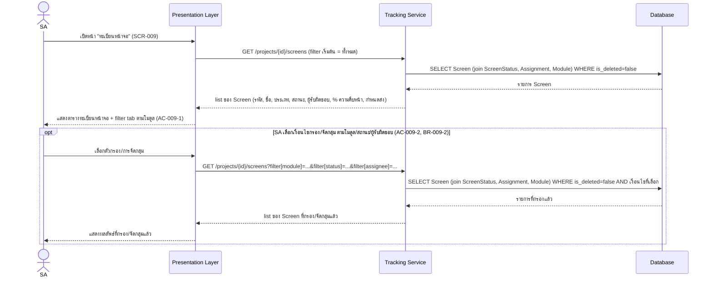

# Detailed Design — SCR-009 ทะเบียนหน้าจอ

- **วันที่สร้าง/อัปเดตล่าสุด:** 2026-08-30
- **สถานะ:** Draft — รอ SA/Dev Lead ตรวจทานและยืนยัน
- **โมดูล:** M2 — วิเคราะห์และออกแบบ
- **อ้างอิง Requirement:** [[../../../01-requirements/01-spec/20260824-009-scr-009-ทะเบียนหน้าจอ|SCR-009]]
- **อ้างอิง Tech Stack:** ยังไม่มีเอกสาร tech-stack.md ณ วันที่เขียน — ใช้ชื่อ layer ทั่วไปตาม Projexa-System-Design-R1.md §3
- **อ้างอิง Prototype:** ไม่มี prototype ณ วันที่เขียน (ตาม acceptance-criteria.md)
- **อ้างอิง Acceptance Criteria:** [[../../../03-testing/01-test-plan/acceptance-criteria|acceptance-criteria]]#scr-009-ทะเบียนหน้าจอ
- **AI Component เกี่ยวข้อง:** ไม่มี — SCR-009 ไม่อยู่ในตาราง §7.1 ของ Projexa-System-Design-R1.md เป็นหน้าจอ list/filter ล้วน ไม่มี step เกี่ยวกับ AI/JSON/Human-in-the-loop gate สำหรับ AI ใน sequence diagram นี้

> เอกสารนี้เป็น **Conceptual Design ระดับหน้าจอ/ฟีเจอร์** ต่างจาก
> [[../tech-stack|tech-stack.md]] ที่เป็นการตัดสินใจเทคโนโลยีระดับระบบ
> เป็นพิมพ์เขียวสำหรับตอนลงมือเขียนโค้ดจริงและฐานของ SDD ในเฟสถัดไป (ดู
> [Projexa-System-Design-R1.md](../../../../Projexa-System-Design-R1.md) §10)

## 1. ภาพรวมเชิงแนวคิด (Conceptual Design)

- **Actor ที่เกี่ยวข้อง:**
  - SA (System Analyst) — ผู้กระทำหลักตาม Acceptance Criteria (AC-009-1,
    AC-009-2)
  - ผู้ใช้ role อื่นที่มีสิทธิ์กับโครงการนี้ — เข้าถึงได้แบบ read-only เท่านั้น
    ตาม api-spec.md (`GET /projects/{id}/screens` เปิดให้ "ทุก role (read)")
    ไม่ใช่ actor หลักของ sequence diagram นี้
- **Layer/Component ที่เกี่ยวข้อง:**
  - Presentation Layer (Web Application)
  - Application Layer → Tracking Service
  - Data Layer → Database
- **Entity ที่เกี่ยวข้อง:**
  - `Screen` (รหัส, ชื่อ, ประเภท, module_id, is_deleted)
  - `ScreenStatus` (current_status, progress_percentage) — join แบบ 1:1 กับ
    `Screen` เพื่อแสดงคอลัมน์สถานะ/% ความคืบหน้า/กำหนดส่ง
  - `Assignment` (role, user_id) — join เพื่อแสดงคอลัมน์ผู้รับผิดชอบ
  - `Module` — ใช้จัดกลุ่ม/แสดง filter tab ตามโมดูล
- **Business Rule ที่เกี่ยวข้อง:**
  - **BR-009-1:** แสดงเฉพาะหน้าจอที่ `is_deleted=false` เท่านั้น
  - **BR-009-2:** กรอง/จัดกลุ่มรายการได้ตามโมดูล สถานะ และผู้รับผิดชอบ
    (AC-009-2)

## 2. Sequence Diagram

SCR-009 ไม่มี AI component เกี่ยวข้อง diagram ด้านล่างครอบคลุม happy path
ทั้งการโหลดรายการครั้งแรกและการกรอง/จัดกลุ่มเพิ่มเติม (เป็น `opt` เพราะไม่ได้
เกิดขึ้นทุกครั้ง)

Diagram ครอบคลุมทั้งการโหลดรายการเริ่มต้นและการกรอง/จัดกลุ่มเพิ่มเติมในหน้าจอ
เดียวกัน โดยแยกส่วนกรองไว้เป็น `opt` เพราะ SA อาจไม่ใช้ตัวกรองเลยก็ได้
เงื่อนไข `is_deleted=false` ถูกบังคับใช้ทั้งสองกรณีเสมอ (BR-009-1)

## 3. Data Flow / เงื่อนไขสำคัญ

- ทุกคำขอ list ต้องกรอง `is_deleted=false` เสมอที่ฝั่ง Tracking Service
  (BR-009-1) ไม่พึ่งการกรองฝั่ง Presentation Layer
- ข้อมูลคอลัมน์สถานะ/% ความคืบหน้า/กำหนดส่ง/ผู้รับผิดชอบ ดึงจาก
  `ScreenStatus`/`Assignment` แบบ join ทุกครั้ง ไม่มีการ cache ค่าที่ไม่ sync
  กับฐานข้อมูล (Single Source of Truth)
- การกรอง/จัดกลุ่มเป็น query parameter ฝั่ง server เสมอ (ไม่ใช่ filter ฝั่ง
  client ล้วน) เพื่อรองรับจำนวนหน้าจอที่มากในอนาคต

## 4. Error / Exception Flow

- โครงการยังไม่มีหน้าจอเลย (0 รายการ) → แสดง empty state พร้อมทางเลือกไปหน้า
  "ผลวิเคราะห์ออกแบบจาก AI" (SCR-008) หรือสร้างหน้าจอเอง
- ตัวกรองไม่ match รายการใดเลย → แสดงข้อความ "ไม่พบหน้าจอที่ตรงเงื่อนไข"
  พร้อมปุ่มล้างตัวกรอง
- โหลดข้อมูลไม่สำเร็จ (server/network error) → แสดง toast แจ้งข้อผิดพลาด +
  ปุ่มลองใหม่ โดยคงค่าตัวกรองเดิมไว้

## 5. Traceability

ยึดสาย `TorClause → Requirement → Screen → TestCase → TestResult` ตาม
[Projexa-System-Design-R1.md](../../../../Projexa-System-Design-R1.md) §4.2

- TorClause: ไม่มี (ตาม spec 009 — ยังไม่มีการนำเข้า TOR จริงของโครงการ ณ
  วันที่สร้างเอกสารต้นทาง)
- Backlog: [[../../../01-requirements/backlog|backlog #009]] — MVP RAISE #8
- Requirement/Spec: [[../../../01-requirements/01-spec/20260824-009-scr-009-ทะเบียนหน้าจอ|SCR-009 spec]]
- Screen: SCR-009 ทะเบียนหน้าจอ
- Acceptance Criteria: AC-009-1, AC-009-2 ใน
  [[../../../03-testing/01-test-plan/acceptance-criteria|acceptance-criteria.md]]
- Test Case: TC-030, TC-031 ใน
  [[../../../03-testing/01-test-plan/test-cases/scr-009-ทะเบียนหน้าจอ|test-cases/scr-009]]
- Prototype: ไม่มี ณ วันที่เขียน

## 6. ประเด็นเปิด / TODO

ไม่มี ณ วันที่เขียน

## ประวัติการอัปเดต

- 2026-08-30: สร้างเอกสารครั้งแรก
