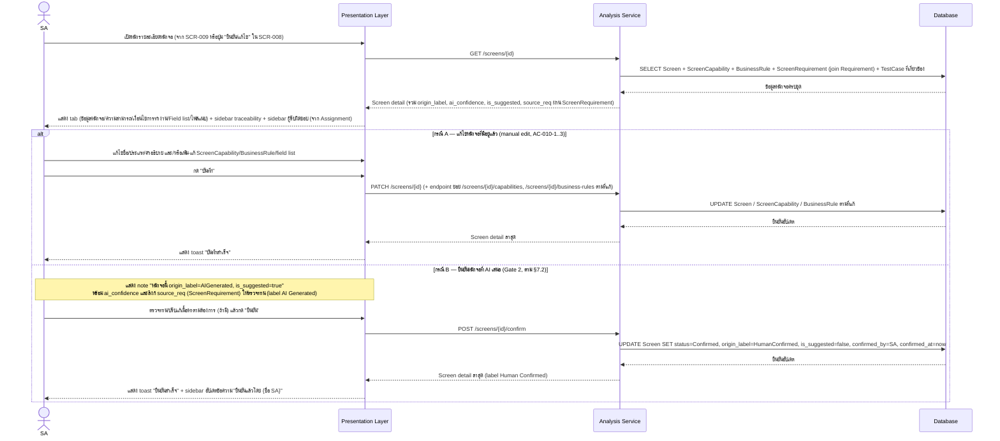

# Detailed Design — SCR-010 รายละเอียดหน้าจอ

- **วันที่สร้าง/อัปเดตล่าสุด:** 2026-08-30
- **สถานะ:** Draft — รอ SA/Dev Lead ตรวจทานและยืนยัน
- **โมดูล:** M2 — วิเคราะห์และออกแบบ
- **อ้างอิง Requirement:** [[../../../01-requirements/01-spec/20260824-010-scr-010-รายละเอียดหน้าจอ|SCR-010]]
- **อ้างอิง Tech Stack:** ยังไม่มีเอกสาร tech-stack.md ณ วันที่เขียน — ใช้ชื่อ layer ทั่วไปตาม Projexa-System-Design-R1.md §3
- **อ้างอิง Prototype:** ไม่มี prototype ณ วันที่เขียน (ตาม acceptance-criteria.md)
- **อ้างอิง Acceptance Criteria:** [[../../../03-testing/01-test-plan/acceptance-criteria|acceptance-criteria]]#scr-010-รายละเอียดหน้าจอ
- **AI Component เกี่ยวข้อง:** **Design Analyzer** (ตาม §7.1) — SCR-010 ไม่ได้
  เรียกงาน AI ใหม่ (งาน AI เกิดที่ SCR-008 ผ่าน `POST
  /projects/{id}/screens/ai-propose`) แต่เป็นจุดแสดงผลที่ AI เสนอไว้แล้วให้ SA
  ตรวจทานรายตัวแบบละเอียดแล้วยืนยัน (Gate 2 ตาม §9 workflow)

> เอกสารนี้เป็น **Conceptual Design ระดับหน้าจอ/ฟีเจอร์** ต่างจาก
> [[../tech-stack|tech-stack.md]] ที่เป็นการตัดสินใจเทคโนโลยีระดับระบบ
> เป็นพิมพ์เขียวสำหรับตอนลงมือเขียนโค้ดจริงและฐานของ SDD ในเฟสถัดไป (ดู
> [Projexa-System-Design-R1.md](../../../../Projexa-System-Design-R1.md) §10)

## 1. ภาพรวมเชิงแนวคิด (Conceptual Design)

- **Actor ที่เกี่ยวข้อง:**
  - SA (System Analyst) — ผู้กระทำหลัก ทั้งแก้ไขหน้าจอเองและยืนยันหน้าจอที่
    AI เสนอ (Gate 2)
- **Layer/Component ที่เกี่ยวข้อง:**
  - Presentation Layer (Web Application)
  - Application Layer → Analysis Service
  - AI Orchestration Layer → Design Analyzer (เกี่ยวข้องเชิงข้อมูล — ผลลัพธ์
    ที่ Design Analyzer เสนอไว้ตั้งแต่ SCR-008 ถูกอ่านมาแสดงที่หน้านี้ ไม่มี
    การเรียกงาน AI ใหม่ในหน้านี้)
  - Data Layer → Database
- **Entity ที่เกี่ยวข้อง:**
  - `Screen` (รวมฟิลด์ `origin_label`, `ai_confidence`, `is_suggested`,
    `status`, `confirmed_by`, `confirmed_at`)
  - `ScreenCapability` (ความสามารถของหน้าจอ)
  - `BusinessRule` (เงื่อนไขการทำงาน)
  - `ScreenRequirement` (ตารางเชื่อม Screen↔Requirement — ใช้แสดงลิงก์
    `source_req`/traceability)
  - `TestCase` (แสดงใน sidebar traceability เท่านั้น อ่านอย่างเดียว)
- **Business Rule ที่เกี่ยวข้อง:**
  - **BR-010-1:** หน้าจอที่ `origin_label=AIGenerated`/`is_suggested=true`
    ต้องแสดง `ai_confidence` และลิงก์ `source_req` (ผ่าน `ScreenRequirement`)
    ให้ SA ตรวจทานก่อนกดยืนยันเสมอ (ตามกติกา §7.2)
  - **BR-010-2:** การยืนยันหน้าจอ (Gate 2) ต้องมี step ให้ SA ตรวจทาน/ยืนยัน
    ก่อนเปลี่ยน `status`→`Confirmed`, `origin_label`→`HumanConfirmed`,
    `is_suggested`→`false` เสมอ — ห้ามให้ AI เขียนค่าเหล่านี้ตรงลง Data Layer
    เอง (§7.2 ข้อ 5)
  - **BR-010-3:** การแก้ไขหน้าจอด้วยตนเอง (manual edit) บันทึกทับค่าเดิมทันที
    ไม่ต้องผ่าน Gate ซ้ำ (AC-010-1..3)

## 2. Sequence Diagram

SCR-010 มี AI component เกี่ยวข้อง (Design Analyzer) แต่ไม่มีการเรียกงาน AI
ใหม่ในหน้านี้ — diagram ด้านล่างแสดงทั้ง 2 กรณีด้วย `alt`: กรณี A แก้ไขหน้าจอ
เอง (manual edit) และกรณี B ยืนยันหน้าจอที่ AI เสนอไว้ (Gate 2) ซึ่งบังคับต้อง
แสดง `ai_confidence`/`source_req` และมี step ให้ SA ยืนยันก่อนบันทึกจริงเสมอ
ตามกติกา §7.2

Diagram แยกด้วย `alt` สองกรณีในหน้าจอเดียวกัน กรณี B (ยืนยัน Gate 2) บังคับ
แสดง `ai_confidence`/`source_req` ก่อนปุ่มยืนยันเสมอ (BR-010-1) และ Data Layer
จะถูกเขียนก็ต่อเมื่อ SA กดยืนยันแล้วเท่านั้น ไม่มี step ใดที่ AI เขียนข้อมูล
ลง Database โดยตรง (BR-010-2)

## 3. Data Flow / เงื่อนไขสำคัญ

- ข้อมูลที่แสดงทุก tab ต้องดึงจาก `Screen`/`ScreenCapability`/`BusinessRule`/
  `ScreenRequirement` จริงเสมอ (Single Source of Truth) ไม่มีการ cache ค่าที่
  ไม่ sync กับฐานข้อมูล
- ฟิลด์ `origin_label`/`ai_confidence`/`is_suggested` เป็นตัวกำหนดว่าต้องแสดง
  label "AI Generated" หรือไม่ — เมื่อ `origin_label=HumanConfirmed` แล้วให้
  แสดง label "Human Confirmed" แทนถาวร
- การยืนยัน (Gate 2) เปลี่ยนสถานะแบบ one-way (`Draft`→`Confirmed`) ในเอกสาร
  นี้ยังไม่ครอบคลุมการถอยสถานะกลับ (ไม่มีข้อมูลจากผู้เรียกให้ออกแบบ flow ถอย
  สถานะที่ SCR-010 นี้)
- ลิงก์ Requirement ที่แสดงใน sidebar traceability ดึงผ่าน `ScreenRequirement`
  เท่านั้น ไม่มีการ hardcode

## 4. Error / Exception Flow

- กด "ยืนยัน" (กรณี B) ทั้งที่ยังไม่มี `ScreenCapability`/field list เลยแม้แต่
  รายการเดียว → บล็อกการยืนยัน แจ้งให้กรอกอย่างน้อย 1 รายการก่อน
- Requirement ที่เคยลิงก์ไว้ถูก soft-delete ไปแล้ว → แสดง badge "ลิงก์ไม่
  พร้อมใช้งานแล้ว" แทนลิงก์ปกติ ไม่บล็อกการบันทึก/ยืนยัน
- บันทึก/ยืนยันไม่สำเร็จ (server error) → toast แจ้งข้อผิดพลาด ฟอร์มไม่ถูก
  รีเซ็ต ให้กดซ้ำได้

## 5. Traceability

ยึดสาย `TorClause → Requirement → Screen → TestCase → TestResult` ตาม
[Projexa-System-Design-R1.md](../../../../Projexa-System-Design-R1.md) §4.2

- TorClause: ไม่มี (ตาม spec 010 — ยังไม่มีการนำเข้า TOR จริงของโครงการ ณ
  วันที่สร้างเอกสารต้นทาง)
- Backlog: [[../../../01-requirements/backlog|backlog #010]] — MVP RAISE #9
- Requirement/Spec: [[../../../01-requirements/01-spec/20260824-010-scr-010-รายละเอียดหน้าจอ|SCR-010 spec]]
- Screen: SCR-010 รายละเอียดหน้าจอ
- Acceptance Criteria: AC-010-1, AC-010-2, AC-010-3, AC-010-4 ใน
  [[../../../03-testing/01-test-plan/acceptance-criteria|acceptance-criteria.md]]
- Test Case: TC-032, TC-033, TC-034, TC-035 ใน
  [[../../../03-testing/01-test-plan/test-cases/scr-010-รายละเอียดหน้าจอ|test-cases/scr-010]]
- Prototype: ไม่มี ณ วันที่เขียน

## 6. ประเด็นเปิด / TODO

ไม่มี ณ วันที่เขียน

## ประวัติการอัปเดต

- 2026-08-30: สร้างเอกสารครั้งแรก
