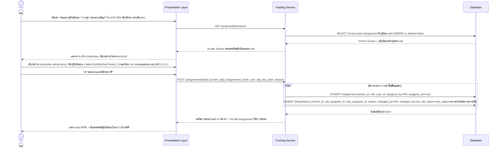

# Detailed Design — SCR-013 มอบหมายผู้รับผิดชอบ

- **วันที่สร้าง/อัปเดตล่าสุด:** 2026-08-30
- **สถานะ:** Draft — รอ SA/Dev Lead ตรวจทานและยืนยัน
- **โมดูล:** M3 — วางแผนและมอบหมายงาน
- **อ้างอิง Requirement:** [[../../../01-requirements/01-spec/20260824-013-scr-013-มอบหมายผู้รับผิดชอบ|SCR-013]]
- **อ้างอิง Tech Stack:** ยังไม่มีเอกสาร tech-stack.md ณ วันที่เขียน — ใช้ชื่อ layer ทั่วไปตาม Projexa-System-Design-R1.md §3
- **อ้างอิง Prototype:** ไม่มี prototype ณ วันที่เขียน (ตาม acceptance-criteria.md)
- **อ้างอิง Acceptance Criteria:** [[../../../03-testing/01-test-plan/acceptance-criteria|acceptance-criteria]]#scr-013-มอบหมายผู้รับผิดชอบ
- **AI Component เกี่ยวข้อง:** ไม่มี — SCR-013 ไม่อยู่ในตาราง §7.1 ของ
  Projexa-System-Design-R1.md เป็นหน้าจอมอบหมายงานล้วน ไม่มี step เกี่ยวกับ
  AI/JSON/Human-in-the-loop gate สำหรับ AI ใน sequence diagram นี้

> เอกสารนี้เป็น **Conceptual Design ระดับหน้าจอ/ฟีเจอร์** ต่างจาก
> [[../tech-stack|tech-stack.md]] ที่เป็นการตัดสินใจเทคโนโลยีระดับระบบ
> เป็นพิมพ์เขียวสำหรับตอนลงมือเขียนโค้ดจริงและฐานของ SDD ในเฟสถัดไป (ดู
> [Projexa-System-Design-R1.md](../../../../Projexa-System-Design-R1.md) §10)

## 1. ภาพรวมเชิงแนวคิด (Conceptual Design)

- **Actor ที่เกี่ยวข้อง:**
  - PM (Project Manager) — ผู้กระทำหลัก (มอบหมาย/เปลี่ยนผู้รับผิดชอบ)
- **Layer/Component ที่เกี่ยวข้อง:**
  - Presentation Layer (Web Application)
  - Application Layer → Tracking Service
  - Data Layer → Database
- **Entity ที่เกี่ยวข้อง:**
  - `Assignment` (screen_id, user_id, role, assigned_by, assigned_at,
    is_deleted)
  - `StatusHistory` — ใช้บันทึกประวัติการเปลี่ยนผู้รับผิดชอบผ่านฟิลด์
    `old_assignee_id`/`new_assignee_id`/`reason` (ตามที่ database-schema.md
    ออกแบบให้ `StatusHistory` ครอบคลุมทั้งการเปลี่ยนสถานะและผู้รับผิดชอบ —
    เมื่อไม่ได้เปลี่ยนสถานะ `old_status`=`new_status`=สถานะปัจจุบันของ
    หน้าจอนั้นๆ)
  - `Screen` (อ่านอย่างเดียวสำหรับตารางซ้าย)
- **Business Rule ที่เกี่ยวข้อง:**
  - **BR-013-1:** การเปลี่ยน/มอบหมายผู้รับผิดชอบต้องกรอกเหตุผล/หมายเหตุ
    เสมอทุกครั้ง (เข้มกว่า SCR-016 ที่บังคับ reason เฉพาะกรณีถอยสถานะ/เลื่อน
    กำหนด)
  - **BR-013-2:** รองรับเลือกหลายหน้าจอมอบหมายพร้อมกันเป็นชุดได้ (AC-013-2)
  - **BR-013-3:** ทุกการเปลี่ยนผู้รับผิดชอบต้องบันทึกลง `StatusHistory` เสมอ
    (AC-013-3 — audit trail)

## 2. Sequence Diagram

SCR-013 ไม่มี AI component เกี่ยวข้อง diagram ด้านล่างครอบคลุม happy path
การมอบหมายเป็นชุด (batch) ซึ่งครอบคลุมทั้งกรณีมอบหมายรายเดียวด้วย (n=1)

Diagram ใช้ `loop` แทนการวนซ้ำต่อคู่ screen×role ที่เปลี่ยนแปลงจริงในธุรกรรม
เดียวกัน ไม่ใช่ธุรกรรมแยกต่อรายการ (ตามที่ผู้เรียกยืนยันมา) เหตุผล/หมายเหตุ
เป็นฟิลด์บังคับกรอกเสมอในทุกกรณี (BR-013-1) ต่างจาก SCR-016 ที่บังคับเฉพาะ
บางเงื่อนไข

## 3. Data Flow / เงื่อนไขสำคัญ

- การมอบหมายเป็นชุดเขียนทั้ง `Assignment` (upsert) และ `StatusHistory`
  (insert) ในธุรกรรมเดียวต่อคู่ screen×role ที่เปลี่ยนแปลง (BR-013-3)
- ตารางซ้าย (`GET /projects/{id}/screens`) ต้องดึงผู้รับผิดชอบปัจจุบันจริง
  จาก `Assignment` เสมอ ไม่ cache ค่าที่ไม่ sync กับฐานข้อมูล
- เหตุผล/หมายเหตุที่กรอกในฟอร์มเดียวกันถูกใช้ซ้ำเป็นค่า `reason` ของทุกแถว
  `StatusHistory` ที่สร้างในการมอบหมายชุดนั้น

## 4. Error / Exception Flow

- ยังไม่ได้เลือกหน้าจอเลย (0 รายการ) → ปุ่ม "มอบหมายและบันทึกประวัติ" ถูก
  disable ไว้ก่อน
- ไม่ได้กรอกเหตุผล/หมายเหตุ → บล็อกการบันทึก แจ้งว่าฟิลด์นี้บังคับกรอกเสมอ
  สำหรับการมอบหมาย/เปลี่ยนผู้รับผิดชอบ
- มอบหมายบางหน้าจอไม่สำเร็จระหว่างทำเป็นชุด (เช่น หน้าจอถูกลบไปแล้วระหว่างนั้น)
  → แสดงผลลัพธ์แยกรายหน้าจอว่าอันไหนสำเร็จ/ไม่สำเร็จ ไม่ rollback รายการที่
  บันทึกสำเร็จแล้ว

## 5. Traceability

ยึดสาย `TorClause → Requirement → Screen → TestCase → TestResult` ตาม
[Projexa-System-Design-R1.md](../../../../Projexa-System-Design-R1.md) §4.2

- TorClause: ไม่มี (ตาม spec 013 — ยังไม่มีการนำเข้า TOR จริงของโครงการ ณ
  วันที่สร้างเอกสารต้นทาง)
- Backlog: [[../../../01-requirements/backlog|backlog #013]] — MVP RAISE #10
- Requirement/Spec: [[../../../01-requirements/01-spec/20260824-013-scr-013-มอบหมายผู้รับผิดชอบ|SCR-013 spec]]
- Screen: SCR-013 มอบหมายผู้รับผิดชอบ
- Acceptance Criteria: AC-013-1, AC-013-2, AC-013-3 ใน
  [[../../../03-testing/01-test-plan/acceptance-criteria|acceptance-criteria.md]]
- Test Case: TC-040, TC-041, TC-042 ใน
  [[../../../03-testing/01-test-plan/test-cases/scr-013-มอบหมายผู้รับผิดชอบ|test-cases/scr-013]]
- Prototype: ไม่มี ณ วันที่เขียน

## 6. ประเด็นเปิด / TODO

- ~~ฟิลด์ "วันส่งงาน" (`due_date`) ที่ปรากฏในขั้นตอนกรอกฟอร์ม (ข้อ 6 ของ
  Sequence flow) ยังไม่มีฟิลด์รองรับใน entity `Assignment`~~ — **แก้ไขแล้ว
  (2026-08-30):** sync ผ่าน skill `data-api-design` เรียบร้อยแล้ว เพิ่มฟิลด์
  `due_date` (DateTime, nullable) เข้าตาราง `Assignment` โดยตรงใน
  [[../database-schema|database-schema.md]] และปรับ request body ของ
  `POST /assignments/batch` ใน [[../api-spec|api-spec.md]] ตามมติที่ user
  ยืนยัน (ผูกกับ screen×role×user แต่ละอัน แยกจาก
  `ScreenStatus.planned_end_date`) — ไม่มีประเด็นเปิดอื่นค้างอยู่

## ประวัติการอัปเดต

- 2026-08-30: สร้างเอกสารครั้งแรก
- 2026-08-30: ปิดประเด็นเปิดเรื่อง `due_date` หลัง sync เข้า
  database-schema.md/api-spec.md แล้ว
