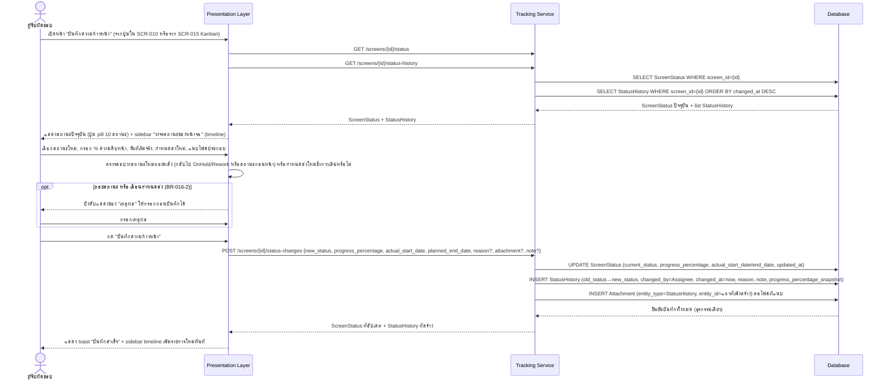

# Detailed Design — SCR-016 บันทึกความก้าวหน้า

- **วันที่สร้าง/อัปเดตล่าสุด:** 2026-08-30
- **สถานะ:** Draft — รอ SA/Dev Lead ตรวจทานและยืนยัน
- **โมดูล:** M4 — ติดตามการดำเนินงาน
- **อ้างอิง Requirement:** [[../../../01-requirements/01-spec/20260824-016-scr-016-บันทึกความก้าวหน้า|SCR-016]]
- **อ้างอิง Tech Stack:** ยังไม่มีเอกสาร tech-stack.md ณ วันที่เขียน — ใช้ชื่อ layer ทั่วไปตาม Projexa-System-Design-R1.md §3
- **อ้างอิง Prototype:** ไม่มี prototype ณ วันที่เขียน (ตาม acceptance-criteria.md)
- **อ้างอิง Acceptance Criteria:** [[../../../03-testing/01-test-plan/acceptance-criteria|acceptance-criteria]]#scr-016-บันทึกความก้าวหน้า
- **AI Component เกี่ยวข้อง:** ไม่มี — SCR-016 ไม่อยู่ในตาราง §7.1 ของ
  Projexa-System-Design-R1.md เป็นหน้าจอบันทึกสถานะ/ความก้าวหน้าล้วน ไม่มี
  step เกี่ยวกับ AI/JSON/Human-in-the-loop gate สำหรับ AI ใน sequence
  diagram นี้

> เอกสารนี้เป็น **Conceptual Design ระดับหน้าจอ/ฟีเจอร์** ต่างจาก
> [[../tech-stack|tech-stack.md]] ที่เป็นการตัดสินใจเทคโนโลยีระดับระบบ
> เป็นพิมพ์เขียวสำหรับตอนลงมือเขียนโค้ดจริงและฐานของ SDD ในเฟสถัดไป (ดู
> [Projexa-System-Design-R1.md](../../../../Projexa-System-Design-R1.md) §10)

## 1. ภาพรวมเชิงแนวคิด (Conceptual Design)

- **Actor ที่เกี่ยวข้อง:**
  - ผู้รับผิดชอบ (ผู้ถูก assign บทบาทใดบทบาทหนึ่งของหน้าจอนั้น — SA/BA/
    Dev/Tester) — ผู้กระทำหลัก
- **Layer/Component ที่เกี่ยวข้อง:**
  - Presentation Layer (Web Application)
  - Application Layer → Tracking Service
  - Data Layer → Database
- **Entity ที่เกี่ยวข้อง:**
  - `ScreenStatus` (current_status, progress_percentage,
    actual_start_date/end_date, updated_at)
  - `StatusHistory` (append-only audit trail: old_status→new_status,
    changed_by, changed_at, reason, note, progress_percentage_snapshot)
  - `Attachment` (entity_type=StatusHistory) — ไฟล์แนบต่อรายการความก้าวหน้า
- **Business Rule ที่เกี่ยวข้อง (§6):**
  - **BR-016-1:** ทุกครั้งที่เปลี่ยนสถานะบังคับบันทึกผู้ทำรายการ/เวลา/สถานะ
    เดิม→ใหม่/ผู้รับผิดชอบเดิม→ใหม่ (ถ้ามี) โดยอัตโนมัติ ไม่ต้องให้ผู้ใช้กรอก
    เอง (AC-016-4)
  - **BR-016-2:** เหตุผลบังคับกรอกเฉพาะเมื่อเลื่อนวันหรือถอยสถานะเท่านั้น
    (ต่างจาก SCR-013 ที่บังคับทุกครั้ง)
  - **BR-016-3:** ไฟล์แนบผูกกับรายการ `StatusHistory` ของขั้นตอนนั้นๆ ผ่าน
    `Attachment` แบบ polymorphic (AC-016-3)

## 2. Sequence Diagram

SCR-016 ไม่มี AI component เกี่ยวข้อง diagram ด้านล่างครอบคลุม happy path
ของการบันทึกความก้าวหน้า โดยใช้ `opt` แสดงเงื่อนไขบังคับกรอกเหตุผลเมื่อถอย
สถานะ/เลื่อนกำหนด

`UPDATE ScreenStatus`, `INSERT StatusHistory`, และ `INSERT Attachment` เกิด
ในธุรกรรมเดียว (synchronous ตาม api-spec.md) ผู้ทำรายการ/เวลาถูกบันทึก
อัตโนมัติจาก session ที่ login เสมอ (BR-016-1) ไม่มีช่องให้ผู้ใช้กรอกเอง

## 3. Data Flow / เงื่อนไขสำคัญ

- `ScreenStatus` (สถานะปัจจุบัน 1:1 ต่อ Screen) และ `StatusHistory`
  (append-only log) ต้องถูกเขียนพร้อมกันในธุรกรรมเดียวเสมอเมื่อมีการเปลี่ยน
  สถานะ (ตาม api-spec.md `POST /screens/{id}/status-changes`)
- เงื่อนไขบังคับกรอกเหตุผลตรวจที่ Presentation Layer ก่อนส่งคำขอ และต้อง
  ตรวจซ้ำที่ Application Layer เสมอ (server-side validation) เพื่อไม่ให้
  ข้ามผ่านได้จากการเรียก API ตรง
- ไฟล์แนบผูกกับ `StatusHistory` แถวที่เพิ่งสร้างเสมอ (ไม่ใช่ผูกกับ `Screen`
  โดยตรง) เพื่อให้แยกไฟล์แนบตามรายขั้นตอนความก้าวหน้าได้ (AC-016-3)

## 4. Error / Exception Flow

- ถอยสถานะ/เลื่อนกำหนดแต่ไม่กรอกเหตุผล → บล็อกการบันทึก, แสดงข้อความแจ้ง
  เตือนที่ช่องเหตุผล
- % ความคืบหน้าไม่สอดคล้องกับสถานะที่เลือก (เช่น เลือก Done แต่กรอก % ต่ำ) →
  แสดง warning แบบไม่บล็อก ให้ผู้ใช้ยืนยันซ้ำก่อนบันทึกจริง
- แนบไฟล์ไม่ผ่าน (เกินขนาด/ประเภทไม่รองรับ) → toast แจ้งเฉพาะไฟล์นั้น ไม่
  กระทบการบันทึกฟิลด์อื่นที่กรอกไว้แล้ว
- บันทึกไม่สำเร็จ (server error) → toast แจ้งข้อผิดพลาด ฟอร์มคงค่าที่กรอกไว้
  ให้กดบันทึกซ้ำได้

## 5. Traceability

ยึดสาย `TorClause → Requirement → Screen → TestCase → TestResult` ตาม
[Projexa-System-Design-R1.md](../../../../Projexa-System-Design-R1.md) §4.2

- TorClause: ไม่มี (ตาม spec 016 — ยังไม่มีการนำเข้า TOR จริงของโครงการ ณ
  วันที่สร้างเอกสารต้นทาง)
- Backlog: [[../../../01-requirements/backlog|backlog #016]] — MVP RAISE #11
- Requirement/Spec: [[../../../01-requirements/01-spec/20260824-016-scr-016-บันทึกความก้าวหน้า|SCR-016 spec]]
- Screen: SCR-016 บันทึกความก้าวหน้า
- Acceptance Criteria: AC-016-1, AC-016-2, AC-016-3, AC-016-4 ใน
  [[../../../03-testing/01-test-plan/acceptance-criteria|acceptance-criteria.md]]
- Test Case: TC-048, TC-049, TC-050, TC-051 ใน
  [[../../../03-testing/01-test-plan/test-cases/scr-016-บันทึกความก้าวหน้า|test-cases/scr-016]]
- Prototype: ไม่มี ณ วันที่เขียน

## 6. ประเด็นเปิด / TODO

ไม่มี ณ วันที่เขียน

## ประวัติการอัปเดต

- 2026-08-30: สร้างเอกสารครั้งแรก
