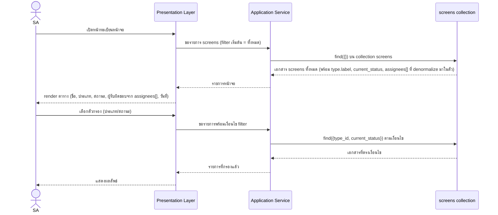
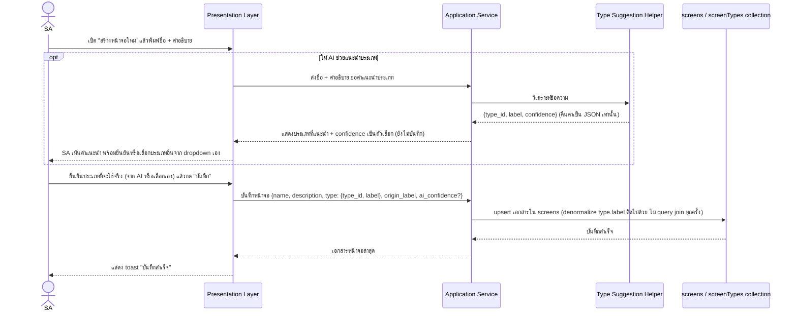
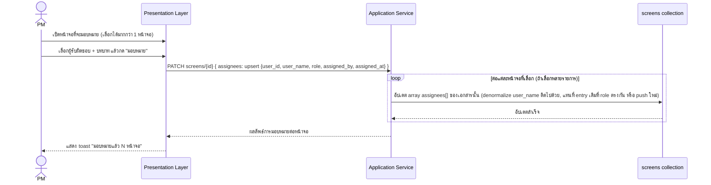
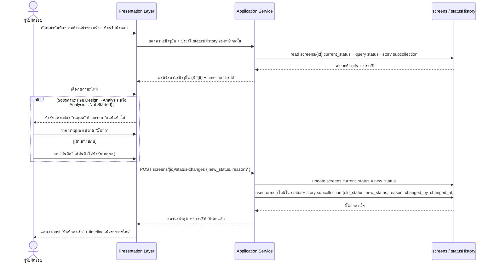

# Screen Tracking Module — Sequence Design (สโคปงานส่งหลักสูตร NoSQL)

- **วันที่สร้าง:** 2026-08-30
- **สถานะ:** Draft — รอตรวจทานก่อนลงมือเขียนโค้ดจริง
- **ขอบเขต:** ใช้เฉพาะโครงสร้างที่ตัดสโคปแล้วใน
  [screen-tracking-nosql-module.md](screen-tracking-nosql-module.md) — 3 สถานะ,
  `assignees[]` แบบ embedded, ประเภทหน้าจอ 5 ค่าเริ่มต้น
- **อ้างอิงต้นทาง:** [screen-tracking-nosql-module.md](screen-tracking-nosql-module.md),
  [SCOPE.md](../../../SCOPE.md)

> **คำเตือนสำคัญ (เหมือนเอกสารต้นทาง):** ไฟล์นี้เป็น sequence design
> ของ**สโคปงานส่งหลักสูตรที่ตัดลดแล้วเท่านั้น** — คนละเรื่องกับ
> [[detailed-design/scr-009-ทะเบียนหน้าจอ|detailed-design/scr-009..016]]
> ซึ่งอ้างอิงระบบ Projexa จริงเต็มรูปแบบ (10 สถานะ, `Assignment` แยกตาราง)
> ห้ามนำ 2 ไฟล์นี้มาปนกันหรือใช้แทนกัน

## ภาพรวม Actor / Layer / Entity (ใช้ร่วมกันทั้ง 4 flow)

- **Actor:** SA (สร้าง/แก้ไข/เลือกประเภทหน้าจอ) · ผู้รับผิดชอบ Dev/Tester
  (กดเปลี่ยนสถานะ) · PM (มอบหมายผู้รับผิดชอบ)
- **Layer:** Presentation Layer → Application Service (Node.js + `firebase-admin`
  SDK ตาม [screen-tracking-nosql-module-tech.md](screen-tracking-nosql-module-tech.md))
  → Document Database (Firebase Firestore)
- **Collection ที่เกี่ยวข้อง:** `screens` (หลัก), `screenTypes` + `users`
  (ประกอบ), `statusHistory` (ย่อย ผูกกับแต่ละ `screens/{id}` โดยเฉพาะ)

---

## 1. รายการหน้าจอ (List — โฟลเดอร์หลัก `screens`)

**Sequence:**

**Error/Exception:**
- ยังไม่มีหน้าจอเลย (collection ว่าง) → empty state พร้อมปุ่ม "สร้างหน้าจอใหม่"
- filter ไม่ match เอกสารใดเลย → ข้อความ "ไม่พบหน้าจอที่ตรงเงื่อนไข" + ปุ่มล้าง filter
- query ล้มเหลว (DB error) → toast แจ้งข้อผิดพลาด + ปุ่มลองใหม่

---

## 2. รายละเอียด/สร้างหน้าจอ + AI แนะนำประเภท

**Business rule:** เมื่อพิมพ์ชื่อ+คำอธิบายหน้าจอ ระบบเรียก AI ช่วยแนะนำ
`screenTypes` ที่น่าจะตรงที่สุดพร้อม confidence — SA ต้องกดยืนยัน/แก้ไขก่อน
บันทึกจริงเสมอ (ไม่ต่างจากหลัก human-in-the-loop ของ Projexa จริง แม้จะเป็น
โมดูลย่อย)

**Error/Exception:**
- AI แนะนำไม่สำเร็จ/timeout → ไม่บล็อกการทำงาน ให้ SA เลือกประเภทจาก dropdown
  เองได้ทันที (AI เป็นแค่ตัวช่วยเสริม ไม่ใช่ทางเดียว)
- ไม่กรอกชื่อหน้าจอ → บล็อกการบันทึก แจ้งเตือน field บังคับ
- บันทึกชนกัน (เอกสารถูกแก้โดยคนอื่นระหว่างนั้น) → แจ้งเตือนให้โหลดข้อมูลใหม่
  ก่อนบันทึกซ้ำ (optimistic concurrency)

---

## 3. มอบหมายผู้รับผิดชอบ (`assignees[]` แบบ embedded)

**หมายเหตุสำคัญ:** ต่างจากระบบจริงที่ใช้ตาราง `Assignment` แยก — โมดูลนี้เขียน
ทับ/เพิ่มสมาชิกใน field `assignees[]` ของเอกสาร `screens/{id}` โดยตรง จึงไม่มี
"โฟลเดอร์ย่อย" อันที่ 2 เกิดขึ้น (ตามข้อจำกัดใน SCOPE.md)

**Error/Exception:**
- ไม่ได้เลือกหน้าจอเลย → ปุ่ม "มอบหมาย" ถูก disable ไว้ก่อน
- มอบหมาย role ที่มีคนอยู่แล้วซ้ำ → แทนที่ entry เดิมในอาร์เรย์ ไม่สร้างซ้ำซ้อน
- บางหน้าจอในชุดที่เลือกถูกลบไปแล้วระหว่างทำ → ข้ามรายการนั้น แสดงผลแยกว่า
  อันไหนสำเร็จ/ไม่สำเร็จ ไม่ยกเลิกรายการที่ทำสำเร็จแล้ว

---

## 4. บันทึกความก้าวหน้า (เปลี่ยนสถานะ → เขียน `statusHistory`)

**Business rule:** สถานะที่ใช้จริงในโมดูลนี้มี 3 ค่า (`Not Started` →
`Analysis` → `Design`) การ**ถอยสถานะ** (เช่น Design→Analysis หรือ
Analysis→Not Started) ต้องกรอกเหตุผลก่อนบันทึกเสมอ — เดินหน้าปกติไม่บังคับ

**Error/Exception:**
- ถอยสถานะแต่ไม่กรอกเหตุผล → บล็อกการบันทึก แจ้งเตือนที่ช่องเหตุผล
- บันทึกไม่สำเร็จ (server error) → toast แจ้งข้อผิดพลาด ค่าที่กรอกไว้ไม่หาย
  ให้กดบันทึกซ้ำได้
- เอกสารหน้าจอถูกลบไปแล้วก่อนกดบันทึก → แจ้งเตือนว่าหน้าจอนี้ไม่มีอยู่แล้ว
  พากลับไปหน้ารายการ

---

## ประวัติการอัปเดต

- 2026-08-30: สร้างเอกสารครั้งแรก — sequence design ครบ 4 flow (list,
  detail+AI suggest, assign แบบ embedded, บันทึกความก้าวหน้า) ตามโครงสร้างที่
  ตัดสโคปไว้ใน `screen-tracking-nosql-module.md` แยกจาก
  `detailed-design/scr-009..016.md` ของระบบจริงโดยเจตนา
- 2026-08-31: เพิ่ม `user_name` เข้า payload PATCH ของ flow ที่ 3
  (มอบหมายผู้รับผิดชอบ) ให้ตรงกับ field `assignees[].user_name` ที่เพิ่มใน
  `screen-tracking-nosql-module.md` — เดิม §1 เขียนไว้แล้วว่า list แสดง
  "ผู้รับผิดชอบจาก assignees[]" แบบ denormalize โดยไม่ query join แต่ payload
  ของ flow ที่ 3 มีแค่ `user_id` ทำให้ไม่มีชื่อให้ denormalize จริง
