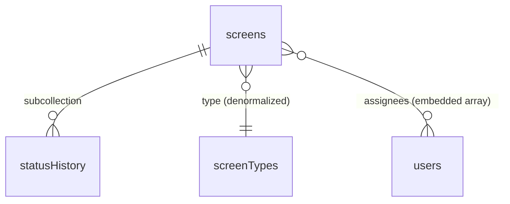

# Screen Tracking Module — ขอบเขต NoSQL (เอกสารประกอบการส่งงานหลักสูตร)

- **วันที่สร้าง:** 2026-08-30
- **สถานะ:** Draft — เอกสารขอบเขตเฉพาะงานส่งหลักสูตร NoSQL ไม่ใช่การเปลี่ยนดีไซน์
  ระบบ Projexa จริง
- **ระดับเอกสาร:** NoSQL Concrete Design (ผูกกับแนวคิด document/collection/
  subcollection ของ NoSQL โดยตรง — **ต่างจาก**
  [[database-schema|database-schema.md]]/[[api-spec|api-spec.md]] ซึ่งจงใจ
  เป็น Conceptual/Logical แบบไม่ผูกมัด DBMS)
- **อ้างอิงต้นทาง:** [[database-schema|database-schema.md]] (entity `Screen`,
  `ScreenStatus`, `StatusHistory`, `Assignment`, `MasterDataItem`),
  [[api-spec|api-spec.md]], [[../../01-requirements/backlog|backlog.md]],
  [SCOPE.md](../../../SCOPE.md)
- **Sequence Design:** ดู
  [[screen-tracking-nosql-module-sequence|screen-tracking-nosql-module-sequence.md]]
  สำหรับ sequence diagram ครบ 4 flow ของโมดูลนี้ (แยกจาก
  [[detailed-design/scr-009-ทะเบียนหน้าจอ|detailed-design/scr-009..016.md]]
  ซึ่งเป็นดีไซน์ของระบบจริงเต็มรูปแบบ)

> **คำเตือนสำคัญ:** เอกสารนี้เป็นการ **"ตัดสโคป"** ของระบบจริงให้พอดีกับ
> เงื่อนไขงานส่ง (ดูตารางใน [SCOPE.md](../../../SCOPE.md)) — ไม่ใช่การเปลี่ยน
> ดีไซน์ของ Projexa `database-schema.md`/`api-spec.md` **ไม่ถูกแก้ไข** และยัง
> เป็นความจริงหลักของระบบเหมือนเดิม (สถานะครบ 9 ค่า/10 ค่า, `Assignment`
> เป็นตารางแยก) ส่วนที่ตัดออกในเอกสารนี้ (สถานะที่เหลือ, ประเภทหน้าจออื่น ฯลฯ)
> ให้ถือเป็นขอบเขตที่ **ยังไม่ทำในรอบนี้** เท่านั้น ไม่ใช่การยกเลิกถาวร

## 1. ขอบเขตโดยสรุป

| ส่วน | จำนวน | รายละเอียด |
|---|---|---|
| โฟลเดอร์หลัก | 1 | `screens` |
| โฟลเดอร์ประกอบ | 2 | `users` (มีอยู่แล้วในระบบ) · `screenTypes` |
| โฟลเดอร์ย่อย | 1 | `statusHistory` (ผูกกับแต่ละ `screen` โดยเฉพาะ) |
| หน้าจอ | 4 | SCR-009, SCR-010, SCR-013, SCR-016 |
| บทบาทผู้ใช้ | 3 | SA · ผู้รับผิดชอบ (Dev/Tester) · PM |
| สถานะที่ใช้จริงในรอบนี้ | 3 | Not Started · Analysis · Design |

## 2. โครงสร้างข้อมูล (NoSQL Concrete)

### `screens` (โฟลเดอร์หลัก)

| ฟิลด์ | ชนิดข้อมูล | คำอธิบาย |
|---|---|---|
| id | Reference | PK |
| code | Text | SCR-xxx (ตาม `Screen.code` เดิม) |
| name | Text | ชื่อหน้าจอ |
| description | Text | คำอธิบาย — input ให้ AI ใช้แนะนำ `type` |
| type | Denormalized {type_id, label} | อ้างจาก `screenTypes` แบบ snapshot ค่า label ติดมาด้วย (ตาม pattern `leaveTypes` — ไม่ query join ทุกครั้ง) |
| assignees | Array of {user_id, role, assigned_by, assigned_at} | **embedded** แทนตาราง `Assignment` แยก เพื่อไม่ให้เกิน "โฟลเดอร์ย่อย 1 อัน" — จำนวนต่อ screen มีจำกัด ไม่โตไม่สิ้นสุดเหมือน `statusHistory` |
| origin_label | Enum(AIGenerated/HumanConfirmed/ManualEntry) | ใครเป็นคนสร้าง (AI หรือ SA/BA/PM) |
| ai_confidence | Number (nullable) | confidence ตอน AI แนะนำ `type` |
| is_suggested | Boolean | รอยืนยันจาก SA หรือยัง |
| current_status | Enum(NotStarted/Analysis/Design) | **subset 3 ค่าของรอบนี้** — enum เต็มดูที่ `database-schema.md` |
| is_deleted | Boolean | soft-delete |

### `screenTypes` (โฟลเดอร์ประกอบ)

| ฟิลด์ | ชนิดข้อมูล | คำอธิบาย |
|---|---|---|
| id | Reference | PK |
| code | Text | เช่น `PROCESS`, `INQUIRY` |
| label | Text | Process / Inquiry / Report UI / Service / Report |
| is_active | Boolean | |

### `users` (โฟลเดอร์ประกอบ — ใช้ของเดิม)

อ้าง `User` ตาม `database-schema.md` ไม่มีการเปลี่ยนแปลง

### `statusHistory` (โฟลเดอร์ย่อย ผูกกับแต่ละ `screen`)

| ฟิลด์ | ชนิดข้อมูล | คำอธิบาย |
|---|---|---|
| id | Reference | PK |
| changed_by | Reference→User | ผู้รับผิดชอบที่กดเปลี่ยน |
| changed_at | DateTime | |
| old_status | Enum | |
| new_status | Enum | |
| reason | Text | **บังคับกรอก** เมื่อถอยสถานะ (ตาม `StatusHistory.reason` เดิม) — ช่องข้อความยาวที่ AI จะอ่านได้ |
| note | Text (nullable) | |

## 3. หน้าจอในสโคป (4 หน้า)

| หน้าจอ | หน้าที่ในโมดูลนี้ |
|---|---|
| [SCR-009 ทะเบียนหน้าจอ](../../01-requirements/01-spec/20260824-009-scr-009-ทะเบียนหน้าจอ.md) | รายการ (list) ของ `screens` |
| [SCR-010 รายละเอียดหน้าจอ](../../01-requirements/01-spec/20260824-010-scr-010-รายละเอียดหน้าจอ.md) | สร้างใหม่/แก้ไข + เลือก `type` + ปุ่มยืนยัน/ปฏิเสธ AI suggestion |
| [SCR-013 มอบหมายผู้รับผิดชอบ](../../01-requirements/01-spec/20260824-013-scr-013-มอบหมายผู้รับผิดชอบ.md) | เพิ่ม/ลบสมาชิกใน `assignees[]` |
| [SCR-016 บันทึกความก้าวหน้า](../../01-requirements/01-spec/20260824-016-scr-016-บันทึกความก้าวหน้า.md) | เปลี่ยน `current_status` + เขียน `statusHistory` |

## 4. บทบาทผู้ใช้ (3 บทบาท)

| บทบาท | หน้าที่ |
|---|---|
| SA | ยืนยัน/ปฏิเสธหน้าจอที่ AI เสนอ (SCR-010) |
| ผู้รับผิดชอบ (Dev/Tester) | กดเปลี่ยนสถานะ (SCR-016) |
| PM | มอบหมายผู้รับผิดชอบ (SCR-013) |

## 5. สถานะที่ใช้ในรอบนี้ (3 ค่า)

`Not Started → Analysis → Design` — subset จาก enum เต็มของ `ScreenStatus`
ใน `database-schema.md` (Development/UnitTest/SIT/UAT/Done/OnHold/Rework
**ยังไม่เปิดใช้ในรอบนี้** ดู §7 ขอบเขตที่ยังไม่ทำ)

## 6. งานที่ AI ช่วย (สัปดาห์ที่ 8)

AI อ่าน `name` + `description` ที่พิมพ์ใน SCR-010 แล้วแนะนำ `screenTypes`
ที่น่าจะตรงที่สุด พร้อมค่า `ai_confidence` — SA ต้องกดยืนยัน/แก้ไขก่อนบันทึกจริง
เสมอ (`is_suggested` เป็น true จนกว่าจะยืนยัน) ตาม pattern เดียวกับ
`origin_label`/`ai_confidence` ที่มีอยู่แล้วใน `Screen` ของ database-schema.md

## 7. ขอบเขตที่ยังไม่ทำในรอบนี้ (ไม่ใช่การตัดถาวร)

- สถานะที่เหลือของวงจรพัฒนาเต็มรูปแบบ: Development, UnitTest, SIT, UAT, Done,
  OnHold, Rework — enum เต็มยังอยู่ใน `database-schema.md` ไม่กระทบ เพิ่มกลับ
  มาใช้ภายหลังได้โดยไม่ต้องแก้โครงสร้าง (เป็นแค่ enum ระดับแอปพลิเคชัน)
- `Assignment` แบบตารางแยกเต็มรูปแบบ (ตอนนี้ใช้ embedded array `assignees[]`
  แทน เพื่อไม่ให้เกิน "โฟลเดอร์ย่อย 1 อัน")
- `screenTypes` ค่าอื่นนอกเหนือจาก Process/Inquiry/Report UI/Service/Report
- `module_id` (Reference→Module ตาม `database-schema.md` เดิม) — **ตัดออกจาก
  สโคปนี้ทั้งหมด** ไม่นำเข้ามาเป็นฟิลด์ของ `screens` เพราะ `Module` จะกลาย
  เป็นโฟลเดอร์ประกอบตัวที่ 3 ซึ่งเกินเงื่อนไข "โฟลเดอร์ประกอบ 2 อัน" ใน
  `SCOPE.md` — การกรอง/จัดกลุ่มในโมดูลนี้ใช้ได้แค่ตาม `type`/`current_status`
  เท่านั้น (ดู AC-NOSQL-009-2)

## ประวัติการตัดสินใจ

- 2026-08-30: สร้างเอกสารครั้งแรก จากบทสนทนาออกแบบสโคปงานส่งหลักสูตร NoSQL —
  เลือกโมดูล Screen Tracking (SCR-009/010/013/016) แทน Requirement/Issue ที่
  เคยพิจารณาไว้ก่อนหน้า เพราะ entity `Screen` มีโครงสร้างที่ตรงกับเงื่อนไข
  งานส่งอยู่แล้วมากที่สุด (type เป็น reference list, status เปลี่ยนได้,
  StatusHistory ที่บังคับ reason) ยืนยันกับ user แล้วว่า `database-schema.md`/
  `api-spec.md` ตัวจริง **ไม่มีการแก้ไข** เอกสารนี้เป็นเอกสารแยกต่างหากเท่านั้น
- 2026-08-30 (รอบตรวจซ้ำ): ตัด field `module_id` (Reference→Module) ออกจาก
  ตาราง `screens` ทั้งหมด — พบระหว่างตรวจทานว่าฟิลด์นี้ตกค้างมาจาก
  `database-schema.md` เดิมโดยไม่ได้ตั้งใจ ทำให้ `Module` กลายเป็นโฟลเดอร์
  ประกอบตัวที่ 3 เกินเงื่อนไข "โฟลเดอร์ประกอบ 2 อัน" ใน `SCOPE.md` (และไม่เคย
  ปรากฏใน ER diagram §2 หรือถูกใช้กรองใน AC/Test Case ที่เขียนไว้แล้วเลย)
  user ยืนยันให้ตัดออกจากสโคปนี้ทั้งหมด
